# AI 中文小说生成网站 — 产品需求文档（PRD）

| 项 | 内容 |
|----|------|
| 版本 | 2.5 |
| 状态 | 草案 |
| 依据 | [chinese-novelist Skill](../docs/chinese-novelist/SKILL.md) |
| 模板库 | 项目根目录 [`tpl/`](../tpl/README.md) |
| 范围 | 功能需求、业务流程、产出物与**内容持久化原则**；**不含**具体技术栈与接口实现 |

---

## 1. 文档目的

本文档用于：

1. 对齐产品、设计、开发对「写一部完整中文小说」全流程的理解  
2. 将 Skill 中的阶段流程映射为 Web 产品的功能模块与页面  
3. 通过 [`tpl/`](../tpl/README.md) 统一引用流程细则与写作模板，便于实现时查阅  

技术架构、数据库、接口设计在 `docs/spec/` 中单独编写。

---

## 2. 产品概述

### 2.1 一句话描述

面向中文网文创作场景，通过**渐进式问答**收集创作意图，自动生成大纲与人物设定，并在用户确认后**全自动逐章写作、校验、交付**的 AI 小说生成网站。

### 2.2 目标用户

| 用户类型 | 诉求 |
|----------|------|
| 想写长篇但难坚持的人 | 少做决策，系统自动写完 |
| 有梗概缺结构的人 | 问答补全设定 + 自动生成大纲 |
| 写过几部的熟手 | 偏好记忆、快捷开写、断点续写 |
| 有史料 / 设定集 / 参考文的作者 | 外接知识库，生成时引用真实资料 |

### 2.3 核心价值

| Skill 能力 | 产品化 |
|-----------|--------|
| 三层递进式问答 | 分步向导（可跳过 / 随机） |
| 偏好记忆 | 账户级偏好，跨作品复用 |
| 中断续写 | 检测未完成项目，从断章继续 |
| 大纲 / 人物 / 写作计划 | **Markdown / JSON 文件**落盘 + 数据库路径索引；可导出 |
| 疯狂创作 | 后台逐章生成 + 进度可视 |
| 自动校验 | 字数与质量检查，不合格自动重写 |
| 内容编辑 | 章节编辑、一致性检查、AI 辅助润色 |
| 成书导出与发布 | TXT / MD / PDF / EPUB 多格式导出 |
| 自定义 AI 模型 | 用户配置 OpenAI 兼容接口与模型 |
| 外接知识库 | 上传文档 / 抓取网址，生成时参考外部资料 |
| 指定章节重生 | 单章大纲 / 正文不满意时可单独重新生成 |

### 2.4 创作三法则（不可违背）

引用 [`tpl/SKILL.md`](../tpl/SKILL.md)：

1. **展示而非讲述** — 用动作和对话表现  
2. **冲突驱动剧情** — 每章须有冲突或转折  
3. **悬念承上启下** — 每章结尾须留钩子  

---

## 3. 术语表

| 术语 | 说明 |
|------|------|
| 项目 / 作品 | 用户创建的一部小说，含配置、大纲、章节 |
| 创作配置 | L1+L2 问答结果（题材、主角、冲突等） |
| 写作计划 | 各章状态机（pending / in_progress / completed / failed） |
| 披露层级 L0–L5 | 渐进式 UI 的信息展开层级（见 §5） |
| Phase 0–4 | 与 Skill 一致的业务阶段编号 |
| 快捷开写 | 用户一段描述即提取要素，跳过部分问答 |
| 规划确认 | 用户明确同意大纲与人物后才进入自动创作 |
| 一致性检查 | 对照人物档案与大纲，发现设定/情节矛盾 |
| AI 辅助润色 | 用户触发或选中文本的智能改写、去 AI 味 |
| 自定义模型 | 用户自配的 API 地址、密钥与模型名（OpenAI 兼容） |
| 成书导出 | 将已完成作品打包为指定格式文件下载 |
| 知识库 | 用户维护的可复用参考资料集合 |
| 参考文档 | 知识库中的单条资料（文件或网址） |
| 参考绑定 | 某部作品关联的一组参考文档 |
| 检索片段 | 生成时从参考文档中选取的相关内容摘要 |
| 章节大纲行 | 单章在 `01-大纲` 7 列规划中的那一行 |
| 重新生成 | 用户主动触发，覆盖指定章的大纲行或正文（非 Phase 4 自动修复） |
| 作品目录 | 单部作品在存储侧的根文件夹，内含该作全部内容文件 |
| 内容文件 | 以 Markdown（或约定 JSON）保存的创作产物实体文件 |
| 路径索引 | 数据库中记录的相对/绝对路径、文件名、类型等，**不含**文件正文 |

---

## 4. 用户场景

### 4.1 场景 A：新用户首作

1. 注册登录 → 首页输入「想写 20 章悬疑，男主刑警查密室杀人」  
2. 系统提取要素 → 用户确认 → 直接生成规划  
3. 预览大纲与人物 → 确认 → 选择串行写作  
4. 离开页面，稍后回来看到进度 8/20 → 最终完成 → 在线阅读  

**流程参照**：[`tpl/flows/phase0-initialization.md`](../tpl/flows/phase0-initialization.md)、[`phase2-planning.md`](../tpl/flows/phase2-planning.md)

### 4.2 场景 B：老用户续写

1. 登录 → 首页提示「《午夜列车》创作中 12/20 章」  
2. 点击继续 → 进入创作进度页，后台从第 13 章续写  
3. 完成后自动校验 → 完成页  

**流程参照**：[`tpl/flows/phase3-writing.md`](../tpl/flows/phase3-writing.md)（启动检测与续写逻辑）

### 4.3 场景 C：完整向导

1. 新建 → L1 三问 → 展开 L2 五问 → 选标题  
2. 查看规划摘要 → 确认 → 自动创作至完稿  

**流程参照**：[`tpl/flows/phase1-layer1-core.md`](../tpl/flows/phase1-layer1-core.md) 至 [`phase1-layer3-title.md`](../tpl/flows/phase1-layer3-title.md)

### 4.4 场景 D：完稿后编辑与成书

1. 作品状态「已完成」→ 进入章节编辑器修改某段对白  
2. 运行**一致性检查** → 系统提示「第 7 章人物口吻与档案不符」→ 用户按建议修改或一键 AI 润色该段  
3. 进入**成书导出** → 选择 PDF + EPUB → 下载；可选填写书名/作者等元数据  

**写作规范参照**：[`tpl/guides/chapter-guide.md`](../tpl/guides/chapter-guide.md)、[`tpl/flows/phase3-writing.md`](../tpl/flows/phase3-writing.md) 润色清单

### 4.5 场景 E：配置自有 AI 模型

1. 设置 → **AI 模型** → 填写接口地址、API Key、模型名称  
2. 测试连接成功 → 设为默认模型  
3. 新建作品自动使用该模型进行规划、创作、润色与一致性分析  

### 4.6 场景 F：外接知识库辅助创作

1. **知识库**中上传《唐代官职表.pdf》、添加百科词条网址  
2. 新建「历史架空」作品 → 规划前勾选上述 2 条参考  
3. 生成大纲时融入官职体系约束；写第 3 章时自动引用参考中的称谓与礼制描述  
4. 编辑某章时仍可追加一篇参考文档并重新生成该段  

### 4.7 场景 G：指定章节重新生成

1. 规划页发现第 8 章大纲与前后衔接突兀 → 点击「重新生成本章大纲」→ 预览新旧对比 → 确认替换  
2. 系统提示「第 9–20 章正文可能需同步调整」→ 用户暂不重写后续  
3. 第 8 章正文完成后不满意 → 在创作进度页「重新生成本章内容」→ 按**最新**第 8 章大纲行重写正文  
4. 已完成全书后，在阅读器中对第 3 章执行「重新生成内容」→ 确认覆盖 → 可选触发单章一致性检查  

**流程参照**：[`tpl/flows/phase2-planning.md`](../tpl/flows/phase2-planning.md)、[`tpl/flows/phase3-writing.md`](../tpl/flows/phase3-writing.md)

---

## 5. 渐进式披露（L0–L5）

### 5.1 层级定义

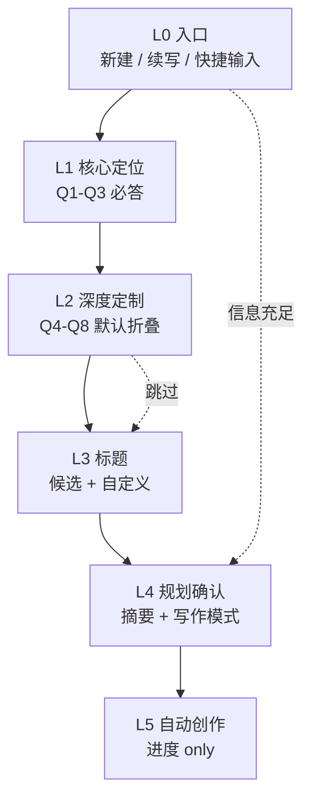

| 层级 | Phase | 用户参与 | 披露策略 |
|------|-------|----------|----------|
| L0 | 0 | 可选输入 | 始终可见：新建、续写、快捷框 |
| L1 | 1 Layer1 | **必答** | 一屏一题；选项 + 自由描述 + 🎲 |
| L2 | 1 Layer2 | 可选 | 默认折叠「高级选项」；可整层跳过 |
| L3 | 1 Layer3 | **必选标题** | 3–5 候选；支持重新生成与自定义 |
| L4 | 2 + 2.5 | **须确认** | 默认摘要；大纲表 / 人物全文折叠展开 |
| L5 | 3 + 4 | **零打扰** | 仅进度与异常；完成后阅读 / 导出 |

### 5.2 交互规则

| 规则 | 说明 |
|------|------|
| 一屏一事 | 向导每步单一决策点 |
| 智能默认 | 有偏好时预填并标 ⭐ |
| 可逆 | 支持上一步、修改单项 |
| 快捷通道 | L0 描述足够时跳过 L1–L2 → 直达 L4 |
| 创作静默 | L5 不弹窗确认；单章失败超 3 次才提示 |

---

## 6. 功能需求

### 6.1 功能架构

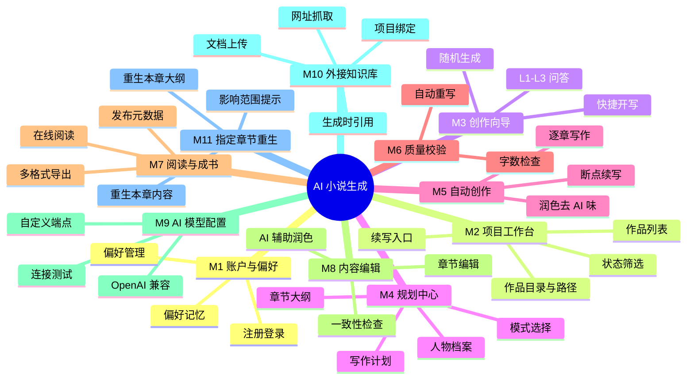

---

### 6.2 M1 · 账户与偏好

| ID | 功能 | 优先级 | 验收要点 |
|----|------|--------|----------|
| M1-01 | 注册 / 登录 | P0 | 用户可创建账户并登录；作品归属当前用户 |
| M1-02 | 偏好自动学习 | P0 | 完成 L1/L2 后静默更新偏好，无需用户操作 |
| M1-03 | 偏好应用于向导 | P0 | 题材等选项排序、⭐ 标记与欢迎语个性化 |
| M1-04 | 偏好查看与重置 | P1 | 用户可查看、修改、重置偏好 |

**数据结构与规则**：[`tpl/flows/shared-infrastructure.md`](../tpl/flows/shared-infrastructure.md)、[`tpl/user-preferences.example.json`](../tpl/user-preferences.example.json)

---

### 6.3 M2 · 项目工作台

| ID | 功能 | 优先级 | 验收要点 |
|----|------|--------|----------|
| M2-01 | 作品列表 | P0 | 展示当前用户全部项目 |
| M2-02 | 状态筛选 | P0 | 可按草稿 / 规划中 / 创作中 / 校验中 / 已完成筛选 |
| M2-03 | 未完成提醒 | P0 | 存在「创作中」「校验中」项目时，首页展示续写入口 |
| M2-04 | 新建作品 | P0 | 进入 L0 / 向导 |
| M2-05 | 删除作品 | P2 | 可删除草稿或已完成作品；同步清理作品目录（实现见技术方案） |
| M2-06 | 作品目录绑定 | P0 | 每部作品对应唯一作品目录；库内仅存 `workspacePath` 等路径索引，见 §9.3 |

---

### 6.4 M3 · 创作向导

| ID | 功能 | 优先级 | 流程文档 |
|----|------|--------|----------|
| M3-01 | 初始化与快捷开写 | P0 | [`phase0-initialization.md`](../tpl/flows/phase0-initialization.md) |
| M3-02 | L1 核心三问 | P0 | [`phase1-layer1-core.md`](../tpl/flows/phase1-layer1-core.md) |
| M3-03 | L2 深度五问（可跳过） | P0 | [`phase1-layer2-customize.md`](../tpl/flows/phase1-layer2-customize.md) |
| M3-04 | L3 标题生成与选择 | P0 | [`phase1-layer3-title.md`](../tpl/flows/phase1-layer3-title.md) |
| M3-05 | 🎲 随机生成 | P1 | 各 layer 流程文档 |
| M3-06 | 配置汇总确认 | P0 | Layer2 末尾确认步骤 |

#### M3-02 L1 采集字段

| 问题 | 字段 |
|------|------|
| Q1 题材与创意 | 题材、创意概要 |
| Q2 主角 | 主角类型、职业/身份、核心性格、关键配角（可选） |
| Q3 核心冲突 | 冲突类型、驱动力 |

#### M3-03 L2 采集字段

| 问题 | 字段 | 备注 |
|------|------|------|
| Q4 世界观 | 世界背景、独特规则 | 都市题材可默认跳过 |
| Q5 视角与基调 | 叙事视角、整体基调 | |
| Q6 核心主题 | 主题 | |
| Q7 读者定位 | 目标读者、风格参考 | 风格参考可跳过 |
| Q8 章节规模 | 章节数、特殊要求 | 默认每章 3000–5000 字 |

**标题生成技法**：[`tpl/guides/title-guide.md`](../tpl/guides/title-guide.md)

---

### 6.5 M4 · 规划中心

| ID | 功能 | 优先级 | 流程 / 模板 |
|----|------|--------|-------------|
| M4-01 | 生成人物档案 | P0 | 输出 `00-人物档案.md`（§9.3）；模板见 [`character-template.md`](../tpl/guides/character-template.md) |
| M4-02 | 生成章节大纲 | P0 | 输出 `01-大纲.md`（§9.3）；模板见 [`outline-template.md`](../tpl/guides/outline-template.md) |
| M4-03 | 生成写作计划 | P0 | 输出 `02-写作计划.json`，含各章 `filePath`（§9.3） |
| M4-04 | 规划摘要展示 | P0 | 默认前 5 章 + 基本信息；完整内容折叠 |
| M4-05 | 规划二次确认 | P0 | 未确认不得进入 M5 |
| M4-06 | 写作模式选择 | P1 | [`phase3-writing.md`](../tpl/flows/phase3-writing.md) |
| M4-07 | 参考文档勾选 | P0 | 与 M10 联动；见 §6.11.2 |
| M4-08 | 重新生成指定章大纲 | P0 | 见 §6.12；规划页 / 大纲表操作 |

#### 大纲 7 列（与模板一致）

| 列 | 说明 |
|----|------|
| 章节 | 第 N 章 |
| 标题 | 章节名 |
| 核心事件 | 本章主线 |
| 承接上章 | 与上章衔接 |
| 章首引子类型 | 见 hook-techniques |
| 悬念钩子 | 章末钩子 |
| 出场人物 | 角色列表 |
| 场景列表 | 场景列表 |

#### 写作模式

| 模式 | 说明 | 优先级 |
|------|------|--------|
| 逐章串行 | 按章顺序完成，稳定默认 | P0 |
| 并行批次 | 章节分批并行，大纲保连贯 | P2 |

---

### 6.6 M5 · 自动创作引擎

| ID | 功能 | 优先级 | 流程 / 模板 |
|----|------|--------|-------------|
| M5-01 | 写前分析 | P0 | 读取本章大纲行 + 出场人物档案 + M10 相关参考片段 |
| M5-02 | 章节撰写 | P0 | 写入 `第NN章-标题.md`（§9.3）；[`chapter-template.md`](../tpl/guides/chapter-template.md) |
| M5-03 | 悬念与引子 | P0 | [`hook-techniques.md`](../tpl/guides/hook-techniques.md) |
| M5-04 | 对话与张力 | P0 | [`dialogue-writing.md`](../tpl/guides/dialogue-writing.md) |
| M5-05 | 字数不足扩充 | P0 | [`content-expansion.md`](../tpl/guides/content-expansion.md) |
| M5-06 | 深度润色 | P0 | [`phase3-writing.md`](../tpl/flows/phase3-writing.md) 步骤 10 |
| M5-07 | 字数检查 | P0 | 单章 3000–5000 字 |
| M5-08 | 摘要回写大纲 | P0 | 每章 300–500 字摘要写入大纲 |
| M5-09 | 进度展示 | P0 | 总进度 + 各章状态 |
| M5-10 | 断点续写 | P0 | 从 in_progress 或 pending 章继续 |
| M5-11 | 全程无确认 | P0 | L5 不向用户请求确认（**例外**：M11 单章重生为用户主动触发） |
| M5-12 | 重新生成指定章内容 | P0 | 见 §6.12；走单章创作子流程 |

**主流程文档**：[`tpl/flows/phase3-writing.md`](../tpl/flows/phase3-writing.md)

#### 单章创作子流程

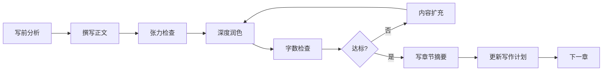

#### 撰写质量要求（摘要）

| 要求 | 标准 |
|------|------|
| 字数 | 3000–5000 字 / 章 |
| 开头 | 即时冲突（十种开头技巧之一） |
| 张力 | 全章 ≥2 个波峰；连续 500 字无冲突须引入新张力 |
| 对话 | 占比 ≥30%，有潜台词或推进情节 |
| 转折 | 每章 ≥1 处打破预期 |
| 人物 | 言行符合人物档案 |
| 结尾 | 悬念钩子（十三式之一） |

---

### 6.7 M6 · 质量校验

| ID | 功能 | 优先级 | 流程文档 |
|----|------|--------|----------|
| M6-01 | 全稿完成度检查 | P0 | [`phase4-validation.md`](../tpl/flows/phase4-validation.md) |
| M6-02 | 字数批量校验 | P0 | 同上 |
| M6-03 | 自动重写 | P0 | 不合格章回 M5，最多 3 轮 |
| M6-04 | 完成报告 | P0 | 总章数、总字数、各章状态 |
| M6-05 | 异常标注 | P0 | 超 3 次仍失败章在报告中 ⚠️ 标注 |

---

### 6.8 M7 · 阅读与成书导出

| ID | 功能 | 优先级 | 说明 |
|----|------|--------|------|
| M7-01 | 章节在线阅读 | P0 | 目录 + 正文；章首引子样式区分 |
| M7-02 | 完成页 | P0 | 统计信息；入口：阅读 / 编辑 / 成书导出 |
| M7-03 | 导出 Markdown | P1 | 单文件或 ZIP；含大纲、人物、各章（对齐 Skill 目录结构） |
| M7-04 | 导出 TXT | P1 | 全书纯文本合并；章节间可选分隔符 |
| M7-05 | 导出 PDF | P1 | 分页排版；含书名、目录 |
| M7-06 | 导出 EPUB | P1 | 电子书标准结构；章节导航 |
| M7-07 | 成书元数据 | P1 | 导出前可填：书名、作者、简介、封面（可选） |
| M7-08 | 批量格式导出 | P2 | 一次选择多种格式打包下载 |
| M7-09 | 发布记录 | P2 | 记录最近导出时间与格式（便于再次下载） |
| M7-10 | 阅读页触发章节重生 | P1 | 跳转 M11「重新生成本章内容」 |

#### 成书导出格式一览

| 格式 | 典型用途 | 优先级 |
|------|----------|--------|
| **MD** | 二次编辑、版本管理 | P1 |
| **TXT** | 通用阅读、轻量分享 | P1 |
| **PDF** | 打印、正式分发 | P1 |
| **EPUB** | 电子阅读器、上架预备 | P1 |

#### 成书导出流程

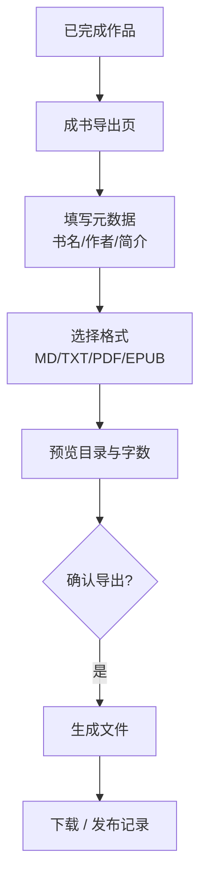

> **说明**：「发布」在本期指**成书导出交付**（生成可分发文件）；对外平台上架、社区公开分享等为后续扩展（见 M7-09 预留）。

---

### 6.9 M8 · 内容编辑

适用于**已完成**或**创作暂停间隙**的人工介入；不替代 Phase 3 自动创作，而是对成稿精修。

| ID | 功能 | 优先级 | 说明 |
|----|------|--------|------|
| M8-01 | 章节正文编辑 | P0 | 编辑 `第NN章-*.md`；保存写回文件并更新路径索引时间戳（§9.3） |
| M8-02 | 大纲 / 人物只读参照 | P0 | 编辑页侧栏展示当前章大纲行与出场人物摘要 |
| M8-03 | 一致性检查（全书） | P0 | 对照人物档案、大纲、已完成章节，输出问题列表 |
| M8-04 | 一致性检查（单章） | P0 | 仅检查当前章与设定及前后章衔接 |
| M8-05 | 问题定位与高亮 | P1 | 检查报告可跳转至对应段落 |
| M8-06 | AI 辅助润色（整章） | P0 | 按 [`phase3-writing.md`](../tpl/flows/phase3-writing.md) 润色规则处理全章 |
| M8-07 | AI 辅助润色（选中片段） | P0 | 用户框选文本 → 润色 / 改写 / 扩写 |
| M8-08 | 润色对比确认 | P0 | 展示修改前后 diff，用户接受或撤销 |
| M8-09 | 编辑后字数校验 | P0 | 仍须满足 3000–5000 字（可配置放宽为警告） |
| M8-10 | 编辑历史 / 版本 | P2 | 章节修订记录，可回滚 |
| M8-11 | 编辑页触发章节重生 | P0 | 与 M11 联动：重生内容 / 先重生大纲再重生内容 |

#### 一致性检查维度

| 维度 | 检查内容 | 示例 |
|------|----------|------|
| 人物一致性 | 性格、口吻、口头禅、能力边界 | 冷静主角突然无铺垫暴走 |
| 情节连贯 | 与大纲、前章摘要、后章伏笔 | 上章重伤本章无提及 |
| 设定一致 | 世界观规则、时间线、地点 | 现代都市章出现未设定法术 |
| 悬念承接 | 上章钩子是否在本章回应 | 章末「门被推开」下章未交代 |

#### 编辑与润色流程

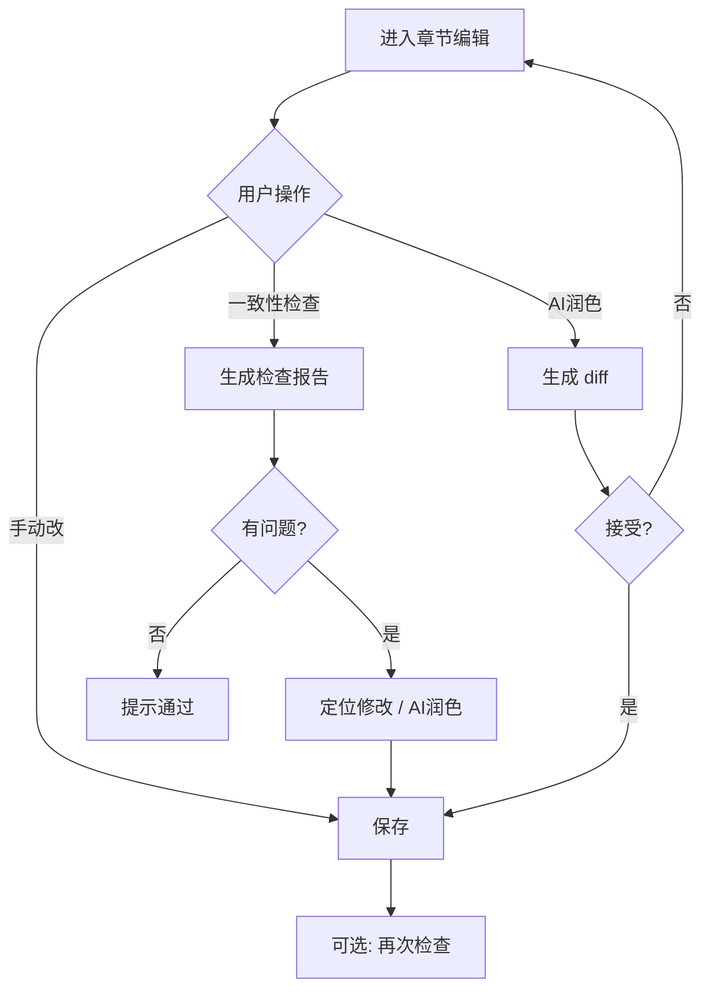

**润色规范**：与自动创作阶段相同，遵循去 AI 味清单（减堆砌形容词、增口语与具象细节等），见 [`tpl/flows/phase3-writing.md`](../tpl/flows/phase3-writing.md)。

---

### 6.10 M9 · 自定义 AI 模型

允许用户使用**自有的 OpenAI 兼容 API** 驱动全书链路（规划、创作、润色、一致性检查等）。

| ID | 功能 | 优先级 | 说明 |
|----|------|--------|------|
| M9-01 | 模型配置项 | P0 | 接口地址（Base URL）、API Key、模型名称 |
| M9-02 | OpenAI 兼容模式 | P0 | 请求格式遵循 OpenAI Chat Completions 约定 |
| M9-03 | 连接测试 | P0 | 保存前发送探测请求，成功/失败明确提示 |
| M9-04 | 多配置管理 | P1 | 可保存多套配置并命名（如「本地 Ollama」「DeepSeek」） |
| M9-05 | 默认模型 | P0 | 指定一套配置为账户默认；新建项目继承 |
| M9-06 | 项目级覆盖 | P1 | 单部作品可临时切换模型，不影响账户默认 |
| M9-07 | 密钥安全 | P0 | Key 仅用户本人可见；展示脱敏；不明文出现在前端日志 |
| M9-08 | 无配置时的降级 | P0 | 未配置自定义模型时使用平台默认（实现见技术方案） |

#### 配置字段（产品概念）

| 字段 | 必填 | 说明 |
|------|------|------|
| 配置名称 | 否 | 便于区分多套，如「我的 GPT」 |
| 接口地址 | 是 | 如 `https://api.openai.com/v1` 或自建代理地址 |
| API Key | 是 | 鉴权密钥 |
| 模型名称 | 是 | 如 `gpt-4o`、`deepseek-chat` |
| 兼容模式 | 固定 | OpenAI Chat Completions（通用 openai 模式） |

#### 模型使用范围

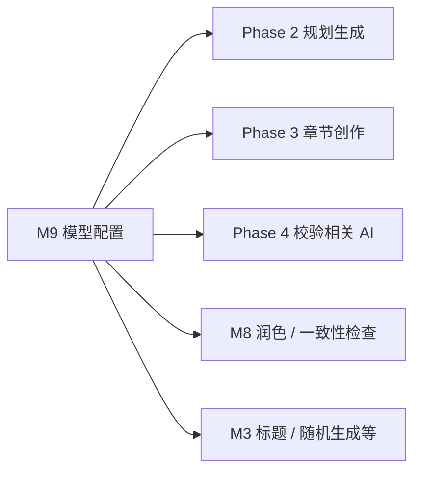

| 能力 | 是否使用用户模型 |
|------|------------------|
| 规划（大纲、人物） | 是 |
| 章节撰写与自动润色 | 是 |
| 快捷开写 / 标题生成 | 是 |
| 编辑态 AI 润色 | 是 |
| 一致性检查（AI 分析） | 是 |

---

### 6.11 M10 · 外接知识库

用户可维护**账户级知识库**，并将选中的参考资料**绑定到具体作品**；在规划、章节创作、润色等 AI 生成环节中，系统检索并注入相关**参考片段**，使输出符合外部设定或事实约束。

#### 6.11.1 知识库管理（账户级）

| ID | 功能 | 优先级 | 说明 |
|----|------|--------|------|
| M10-01 | 知识库列表 | P0 | 展示当前用户全部参考文档 |
| M10-02 | 上传文档 | P0 | 支持本地文件导入（见下表格式） |
| M10-03 | 添加网址 | P0 | 输入 URL，系统抓取并解析正文 |
| M10-04 | 文档解析状态 | P0 | 处理中 / 可用 / 失败；失败展示原因 |
| M10-05 | 文档预览 | P1 | 查看解析后的文本摘要或分段预览 |
| M10-06 | 重命名 / 备注 | P1 | 便于区分「世界观设定」「历史年表」等 |
| M10-07 | 删除参考文档 | P0 | 删除前提示是否被作品引用 |
| M10-08 | 标签分类 | P2 | 按题材、类型打标签，便于筛选 |

#### 支持的参考来源

| 类型 | 说明 | 优先级 |
|------|------|--------|
| **网址** | 用户提交 HTTP/HTTPS 链接；抓取页面正文（需遵守 robots 与合规要求，实现见技术方案） | P0 |
| **文档上传** | 用户上传本地文件，系统提取文本 | P0 |

#### 支持的文档格式（上传）

| 格式 | 扩展名 | 优先级 |
|------|--------|--------|
| 纯文本 | `.txt` | P0 |
| Markdown | `.md` | P0 |
| Word | `.docx`, `.doc` | P0 |
| PDF | `.pdf` | P1 |
| EPUB | `.epub` | P2 |

> 单文件大小、总容量上限由技术方案定义；产品侧须提示超限与解析失败。

#### 6.11.2 作品级参考绑定

| ID | 功能 | 优先级 | 说明 |
|----|------|--------|------|
| M10-09 | 新建时绑定参考 | P0 | 向导末段或 L4 规划页可选择知识库中的文档 |
| M10-10 | 创作中增删参考 | P1 | 规划确认前可调整；创作中新增参考仅影响后续章节（见规则） |
| M10-11 | 绑定列表展示 | P0 | 作品详情展示已绑定的参考文档及解析状态 |
| M10-12 | 全量 / 按需引用模式 | P1 | **全量**：规划阶段纳入全部绑定文档摘要；**按需**：每章检索最相关片段 |
| M10-13 | 参考用量提示 | P1 | 展示本次生成引用了哪些文档、哪些片段（可追溯） |

**绑定时机（渐进式披露）**：

| 时机 | 披露方式 |
|------|----------|
| L4 规划确认前 | 折叠区「参考文档（可选）」→ 从知识库勾选 |
| 作品设置 | 已完成 / 创作中均可管理绑定（增删规则见下） |

**增删规则（产品约定）**：

| 操作 | 影响范围 |
|------|----------|
| 规划确认前增加参考 | 纳入 Phase 2 规划及之后全部生成 |
| 创作中增加参考 | 仅影响**尚未开始**的章节；已完成章不自动重写 |
| 创作中移除参考 | 不影响已生成章节；后续章节不再引用 |
| 编辑后重新生成单章 | 按当前绑定参考重新检索 |

#### 6.11.3 生成时参考注入

参考文档在以下环节参与内容生成（与大纲、人物档案并列作为上下文）：

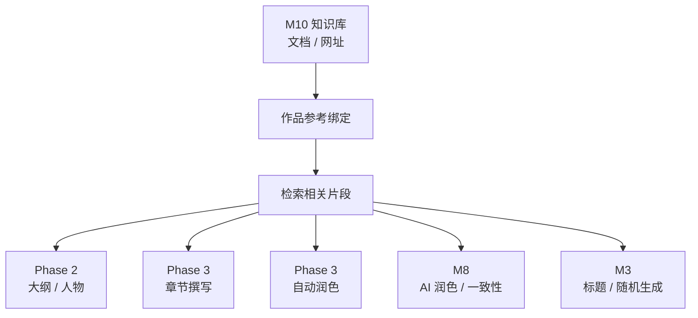

| 生成环节 | 参考用途（产品要求） | 优先级 |
|----------|----------------------|--------|
| Phase 2 规划 | 约束世界观、时代背景、专有名词；影响大纲与人物设定 | P0 |
| Phase 3 章节撰写 | 本章相关设定、事实、氛围素材；**不得违背**已与大纲冲突的参考 | P0 |
| Phase 3 润色 | 专有名词、称谓统一 | P1 |
| M8 AI 润色 | 用户可选「参照知识库润色」 | P1 |
| M8 一致性检查 | 与参考文档中的硬性设定比对（如年表、规则） | P2 |
| M3 标题 / 随机 | 可选参考作品题材文档 | P2 |

**引用原则**：

1. **参考优先于臆造**：绑定文档中的明确设定，生成时不得随意推翻  
2. **服从三法则与大纲**：参考用于丰富细节，不替代冲突、悬念与章节结构要求  
3. **冲突处理**：参考文档之间或参考与创作配置冲突时，在规划确认页给出 ⚠️ 提示，由用户决定以哪方为准  
4. **可追溯**：生成日志或章节详情可查看「本章参考了哪些片段」（M10-13）

#### 6.11.4 网址类参考的特殊要求

| ID | 功能 | 优先级 | 说明 |
|----|------|--------|------|
| M10-14 | URL 校验 | P0 | 非法地址、无法访问时明确报错 |
| M10-15 | 抓取结果预览 | P0 | 用户确认抓取正文无误后再入库 |
| M10-16 | 定期刷新 | P2 | 用户可手动「重新抓取」更新内容 |
| M10-17 | 版权与合规提示 | P0 | 添加网址 / 上传时提示用户需拥有合法使用权 |

#### 知识库使用流程

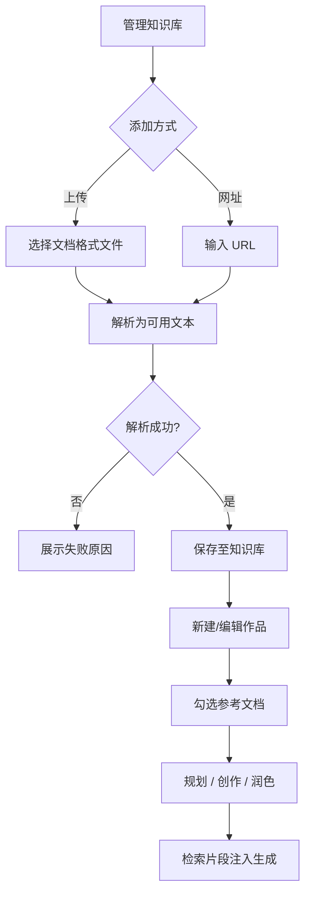

---

### 6.12 M11 · 指定章节重生

用户对**某一章**的大纲规划或正文不满意时，可单独触发重新生成，无需全书重来。与 Phase 4「校验失败自动重写」区分：M11 为**用户主动**、可随时发起。

#### 6.12.1 重新生成指定章节大纲

| ID | 功能 | 优先级 | 说明 |
|----|------|--------|------|
| M11-01 | 选择目标章节 | P0 | 在大纲表 / 章节列表中指定第 N 章 |
| M11-02 | 可选指令 | P1 | 用户补充说明，如「加强悬念」「与第 7 章衔接更紧」 |
| M11-03 | 上下文注入 | P0 | 基于全书大纲、前后章大纲行、人物档案、创作配置、M10 参考 |
| M11-04 | 生成新大纲行 | P0 | 输出完整 7 列 + 必要时更新承接关系提示 |
| M11-05 | 新旧对比预览 | P0 | 并排或 diff 展示，用户确认后替换 |
| M11-06 | 影响范围提示 | P0 | 若该章已有正文，提示「正文可能与新区划不一致」并提供「同步重生内容」入口 |
| M11-07 | 后续章衔接提示 | P1 | 若本章悬念/承接变更，提示检查第 N+1 章及之后大纲 |

**可用时机**：规划确认后任意时刻（含创作中、已完成）。

**模板参照**：[`tpl/guides/outline-template.md`](../tpl/guides/outline-template.md)

#### 6.12.2 重新生成指定章节内容

| ID | 功能 | 优先级 | 说明 |
|----|------|--------|------|
| M11-08 | 选择目标章节 | P0 | 创作进度页、阅读器、编辑页均可入口 |
| M11-09 | 写前上下文 | P0 | 当前章**最新**大纲行 + 出场人物 + 前章摘要 + M10 参考 |
| M11-10 | 执行单章创作子流程 | P0 | 同 §6.6：撰写 → 润色 → 字数检查 → 摘要回写大纲 |
| M11-11 | 覆盖确认 | P0 | 若该章已有正文，须确认后覆盖；支持预览后再写入 |
| M11-12 | 更新写作计划 | P0 | 该章 `status` → completed，更新 `wordCount` |
| M11-13 | 可选指令 | P1 | 如「语气更轻松」「增加对话比重」 |
| M11-14 | 重生后一致性检查 | P1 | 可选对该章执行 M8 单章一致性检查 |

**可用时机**：

| 作品状态 | 是否可重生内容 | 说明 |
|----------|----------------|------|
| 创作中 | 是 | 最常使用；可打断自动队列，优先生成该章 |
| 已完成 | 是 | 覆盖原正文；全书状态仍为已完成 |
| 规划中（尚无正文） | 否 | 应使用 M11 大纲重生或等待首次创作 |

**与自动创作关系**：

| 场景 | 行为 |
|------|------|
| 串行创作进行中用户重生第 K 章 | 暂停队列 → 完成第 K 章重生 → 从第 K 或 K+1 章继续（实现见技术方案） |
| 已完成作品重生某章 | 仅更新该章，不触发全书 Phase 4，除非用户手动「全书校验」 |

#### 6.12.3 联动规则（大纲 ↔ 正文）

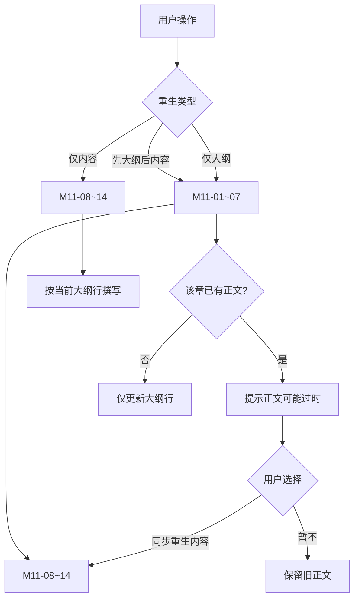

| 规则 | 说明 |
|------|------|
| 正文服从大纲 | 重生内容时以当前大纲行为准，不以旧正文为准 |
| 大纲变更不自动改正文 | 除非用户确认「同步重生内容」 |
| 摘要同步 | 内容重生成功后更新大纲中该章 300–500 字摘要 |
| 三法则 | 重生结果仍须满足 §2.4 与 [`chapter-guide.md`](../tpl/guides/chapter-guide.md) |

#### 6.12.4 入口与页面

| 入口位置 | 大纲重生 | 内容重生 |
|----------|----------|----------|
| 规划预览 / 大纲表 | ✓ | — |
| 创作进度 · 章节列表 | ✓ | ✓ |
| 章节编辑页 | ✓ | ✓ |
| 阅读器 | — | ✓ |

---

## 7. 业务流程

### 7.1 端到端流程

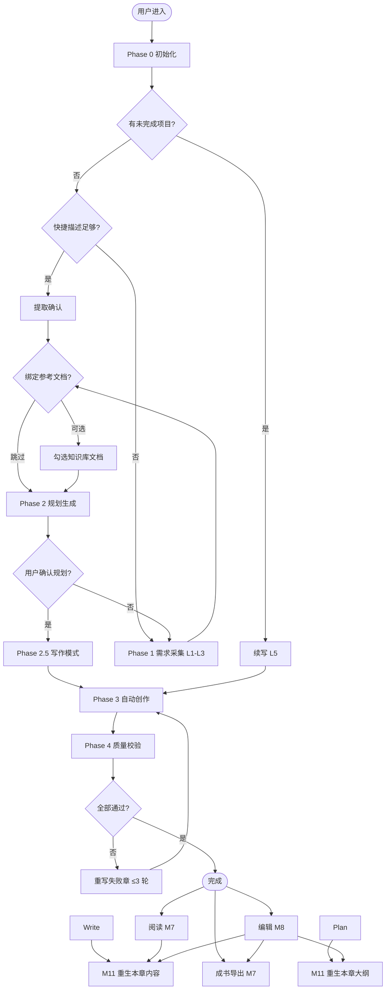

### 7.1.1 完稿后能力（M7 / M8）

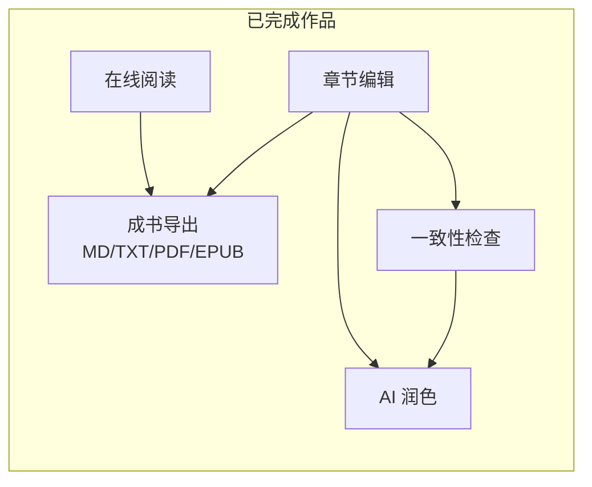

### 7.2 项目状态机

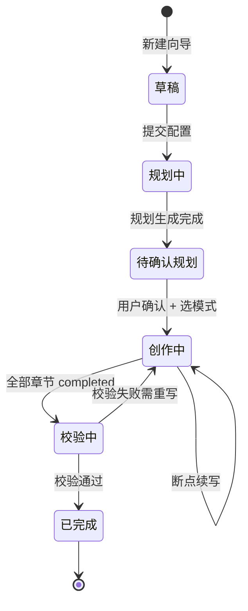

| 状态 | 含义 | 用户可操作 |
|------|------|------------|
| 草稿 | 向导未完成 | 继续向导 |
| 规划中 | 正在生成大纲 / 人物 | 等待 |
| 待确认规划 | 规划已出，待确认 | 确认 / 修改配置 |
| 创作中 | Phase 3 执行中 | 查看进度 |
| 校验中 | Phase 4 执行中 | 查看进度 |
| 已完成 | 可阅读、编辑、成书导出 | 阅读、编辑、一致性检查、润色、导出 |

### 7.3 写作计划章节状态

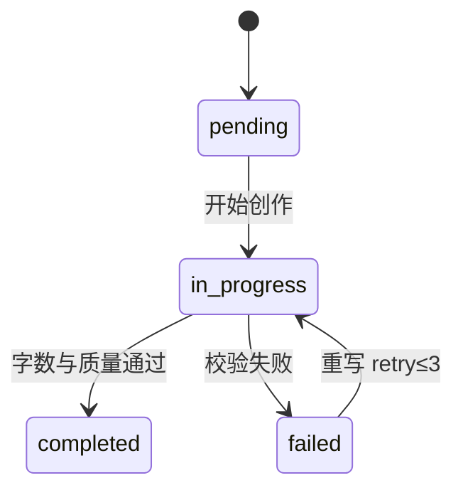

---

## 8. 阶段流程与 tpl 对照

进入每一阶段前，实现侧应阅读对应 `tpl/flows/` 文档。

| Phase | 名称 | 用户参与 | 主要产出 | 流程文档 |
|-------|------|----------|----------|----------|
| 0 | 初始化 | 可选 | 路由决策 | [`phase0-initialization.md`](../tpl/flows/phase0-initialization.md) |
| 1 L1 | 核心定位 | 必答 | 题材/主角/冲突 | [`phase1-layer1-core.md`](../tpl/flows/phase1-layer1-core.md) |
| 1 L2 | 深度定制 | 可选 | 完整创作配置 | [`phase1-layer2-customize.md`](../tpl/flows/phase1-layer2-customize.md) |
| 1 L3 | 标题 | 必选 | 小说标题 | [`phase1-layer3-title.md`](../tpl/flows/phase1-layer3-title.md) |
| 2 | 规划 | 确认 | 人物、大纲、写作计划（可含 M10 参考） | [`phase2-planning.md`](../tpl/flows/phase2-planning.md) |
| 2.5 | 写作模式 | 选择 | writingMode | [`phase3-writing.md`](../tpl/flows/phase3-writing.md) §模式 |
| 3 | 自动创作 | **无** | 各章正文 + 摘要 | [`phase3-writing.md`](../tpl/flows/phase3-writing.md) |
| 4 | 校验 | **无** | 完成报告 | [`phase4-validation.md`](../tpl/flows/phase4-validation.md) |
| — | 共享机制 | — | 偏好、计划、法则 | [`shared-infrastructure.md`](../tpl/flows/shared-infrastructure.md) |

### 8.1 Phase 3 主循环（串行）

```
WHILE 写作计划中存在 status ≠ completed 的章节:
    执行单章创作子流程（§6.6）
    立即认领下一 pending 章，不询问用户
全部完成 → Phase 4
```

> **铁律**（[`tpl/SKILL.md`](../tpl/SKILL.md)）：进入 Phase 3 后禁止向用户确认，必须全部章节完成才可报告完成。

---

## 9. 产出物规范

### 9.1 项目产出物清单

与 Skill 本地目录结构对齐；**正文类产出一律以文件落盘**，数据库只维护路径与状态索引（见 §9.3）。

| 产出物 | 存储形式 | 模板 / 说明 | 生成阶段 |
|--------|----------|-------------|----------|
| 用户偏好 | JSON 文件（账户级） | [`user-preferences.example.json`](../tpl/user-preferences.example.json) | Phase 1 静默更新 |
| `00-人物档案.md` | **Markdown 文件** | [`character-template.md`](../tpl/guides/character-template.md) | Phase 2 |
| `01-大纲.md` | **Markdown 文件** | [`outline-template.md`](../tpl/guides/outline-template.md) | Phase 2；摘要 Phase 3 追加 |
| `02-写作计划.json` | JSON 文件（作品目录内） | [`shared-infrastructure.md`](../tpl/flows/shared-infrastructure.md) | Phase 2 |
| `第NN章-标题.md` | **Markdown 文件** | [`chapter-template.md`](../tpl/guides/chapter-template.md) | Phase 3 |
| 作品参考绑定列表 | 数据库元数据 + 知识库文件路径 | M10 | L4 勾选后持久化 |
| 章节参考追溯 | 可选元数据 / 侧车文件 | 本章引用的知识库片段摘要 | Phase 3 / M8 |

> **铁律**：`00-人物档案`、`01-大纲`、各章 `第NN章-*.md` 的**全文不得写入关系型数据库 BLOB/TEXT 字段**；库中仅保存 `filePath`、`fileType`、`checksum`（可选）、`updatedAt` 等索引字段。

### 9.2 作品目录结构（概念）

每部作品对应一个作品目录，命名与 Skill 一致（实现可映射为 `{时间戳}-{小说标题}/`）：

```text
{作品目录}/
├── 00-人物档案.md      # 人物设定全文
├── 01-大纲.md          # 章节规划表 + 各章摘要区
├── 02-写作计划.json    # 章状态、字数、filePath、写作模式
├── 第01章-章节标题.md
├── 第02章-章节标题.md
└── …
```

| 操作 | 读写对象 |
|------|----------|
| M4 生成 / M11 重生大纲 | 读写 `01-大纲.md`；更新库中大纲文件路径与版本时间 |
| M4 生成人物 | 写入 `00-人物档案.md` |
| M5 / M11 创作或重生正文 | 读写 `第NN章-*.md`；同步 `02-写作计划.json` 中 `wordCount`、`status` |
| M8 编辑 / 润色 | 用户确认后**写回**对应章节 `.md` |
| M7 阅读 / 导出 | 从 `.md` 读取渲染或转码，不依赖库内正文副本 |
| M6 校验 | 读 `.md` 计字数与质量；结果写回 JSON 状态 |

### 9.3 内容持久化原则

| 原则 | 说明 |
|------|------|
| **文件为真源** | 人物档案、大纲、章节正文的权威副本是 Markdown 文件；任何展示、导出、重生、编辑均以文件为准 |
| **库仅存索引** | 数据库保存作品目录路径、各内容文件的相对路径、章节序号、状态机、字数统计、用户归属等**元数据** |
| **读写流程** | 生成 / 更新：先写文件 → 再更新路径索引与状态；读取：按路径加载文件 → 可选缓存（实现见 `docs/spec/`） |
| **与 Skill 对齐** | 文件名、章节 `filePath` 字段与 [`phase2-planning.md`](../tpl/flows/phase2-planning.md) 约定一致，便于导出与离线备份 |
| **例外** | L1/L2 **创作配置**、账户**偏好**、M10 **绑定关系**等结构化短数据可存库或独立 JSON；**不**将长篇 Markdown 正文入库 |
| **删除与迁移** | 删除作品时删除或归档整个作品目录；路径变更时批量更新索引（技术方案另文） |

#### 9.3.1 数据库侧概念字段（不含实现）

| 实体 | 库内保存（示例） | 库内**不**保存 |
|------|------------------|----------------|
| 作品 | `id`、`userId`、`title`、`workspacePath`、`status`、时间戳 | 人物/大纲/章节全文 |
| 内容文件索引 | `projectId`、`fileType`（character / outline / chapter）、`relativePath`、`chapterNumber`（可选）、`updatedAt` | 文件正文 |
| 章节进度 | 来自 `02-写作计划.json` 的同步字段或解析缓存：`status`、`wordCount`、`retryCount` | 章节 Markdown 正文 |

### 9.4 写作计划逻辑结构（概念）

```json
{
  "novelName": "小说标题",
  "totalChapters": 20,
  "status": "in_progress",
  "writingMode": "serial",
  "chapters": [
    {
      "chapterNumber": 1,
      "title": "章节标题",
      "status": "pending",
      "wordCount": null,
      "retryCount": 0
    }
  ]
}
```

字段含义详见 [`tpl/flows/shared-infrastructure.md`](../tpl/flows/shared-infrastructure.md)。`chapters[].filePath` 须与作品目录内实际 `.md` 文件名一致。

---

## 10. 页面与模块映射

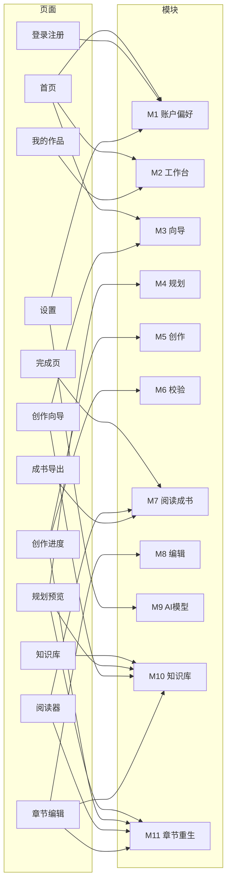

| 页面 | 模块 | Phase |
|------|------|-------|
| 首页 | M1, M2, M3(L0) | 0 |
| 登录 / 注册 | M1 | — |
| 我的作品 | M2 | — |
| 创作向导 | M3, M10（可选绑定） | 1 |
| 规划预览 | M4, M10, M11（大纲） | 2, 2.5 |
| 创作进度 | M5, M6, M11 | 3, 4 |
| 完成页 | M6, M7 | 完成 |
| 阅读器 | M7 | 完成 |
| 章节编辑 | M8, M10, M11 | 完成（或创作暂停时） |
| 成书导出 | M7 | 完成 |
| 知识库管理 | M10 | — |
| 设置 · AI 模型 | M9 | — |

---

## 11. 模板与流程文档索引

完整目录见 [`tpl/README.md`](../tpl/README.md)。

### 11.1 流程文档（`tpl/flows/`）

| 文件 | 用途 |
|------|------|
| [`phase0-initialization.md`](../tpl/flows/phase0-initialization.md) | 偏好加载、续写检测、快捷入口 |
| [`phase1-layer1-core.md`](../tpl/flows/phase1-layer1-core.md) | Q1–Q3 核心定位 |
| [`phase1-layer2-customize.md`](../tpl/flows/phase1-layer2-customize.md) | Q4–Q8 深度定制 |
| [`phase1-layer3-title.md`](../tpl/flows/phase1-layer3-title.md) | 标题生成与选择 |
| [`phase2-planning.md`](../tpl/flows/phase2-planning.md) | 人物、大纲、写作计划 |
| [`phase3-writing.md`](../tpl/flows/phase3-writing.md) | 逐章创作、模式、润色 |
| [`phase4-validation.md`](../tpl/flows/phase4-validation.md) | 校验与自动修复 |
| [`shared-infrastructure.md`](../tpl/flows/shared-infrastructure.md) | 偏好、写作计划、字数规则 |

### 11.2 写作模板与指南（`tpl/guides/`）

| 文件 | 用途 |
|------|------|
| [`outline-template.md`](../tpl/guides/outline-template.md) | 大纲结构与 7 列表格 |
| [`character-template.md`](../tpl/guides/character-template.md) | 人物档案结构 |
| [`chapter-template.md`](../tpl/guides/chapter-template.md) | 章节文件结构 |
| [`chapter-guide.md`](../tpl/guides/chapter-guide.md) | 章节写作质量要求 |
| [`hook-techniques.md`](../tpl/guides/hook-techniques.md) | 章首引子、结尾钩子 |
| [`character-building.md`](../tpl/guides/character-building.md) | 人物塑造技法 |
| [`dialogue-writing.md`](../tpl/guides/dialogue-writing.md) | 对话规范 |
| [`content-expansion.md`](../tpl/guides/content-expansion.md) | 字数不足扩充 |
| [`plot-structures.md`](../tpl/guides/plot-structures.md) | 情节结构 |
| [`title-guide.md`](../tpl/guides/title-guide.md) | 标题创作 |

### 11.3 总览

| 文件 | 用途 |
|------|------|
| [`tpl/SKILL.md`](../tpl/SKILL.md) | Skill 总流程与阶段索引 |
| [`tpl/user-preferences.example.json`](../tpl/user-preferences.example.json) | 偏好 JSON 示例 |

---

## 12. 非功能需求（产品级）

| 类别 | 要求 |
|------|------|
| 可用性 | 向导步骤清晰；L5 可离开页面，进度可恢复 |
| 一致性 | 生成内容符合 tpl 模板结构与三法则 |
| 安全 | 用户只能访问自己的作品（实现见技术方案） |
| 配额 | 需限制滥用（实现见技术方案） |
| 隐私 | 作品内容不对其他用户可见（除非未来做分享） |
| 密钥 | 用户 API Key 仅本人可配置与使用（实现见技术方案） |
| 导出 | 大文件导出需进度提示，失败可重试 |
| 知识库 | 用户上传内容隔离；网址抓取需合规；注明版权责任 |

---

## 13. 分期交付

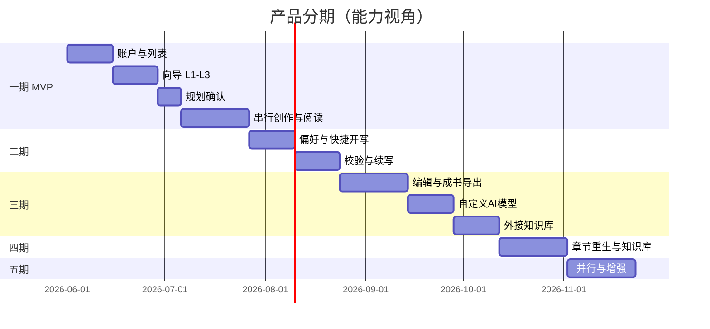

| 分期 | 交付模块 | 验收标准（摘要） |
|------|----------|------------------|
| **一期** | M1, M2, M3, M4, M5(串行), M7 阅读 | 10 章作品可走通：向导→确认→自动写完→阅读 |
| **二期** | M1 偏好, M3 L0/L2, M5 续写, M6 | 偏好生效；中断可续；校验与重写 |
| **三期** | M8 编辑, M7 成书导出, M9 自定义模型 | 可编辑润色；四格式导出；自有 API 可用 |
| **四期** | M10 知识库, M11 章节重生, M5 并行 | 参考库；单章大纲/内容重生；并行创作 |
| **五期** | M7/M8 增强 | 批量导出、版本历史等 |

---

## 14. 验收标准（EARS 摘要）

| 编号 | 标准 |
|------|------|
| AC-01 | **When** 用户完成 L1 三问，**then** 系统应保存创作配置并更新偏好 |
| AC-02 | **When** 用户跳过 L2，**then** 系统应使用题材默认值补全配置 |
| AC-03 | **When** 用户未确认规划，**then** 系统不得进入自动创作 |
| AC-04 | **When** 进入 Phase 3，**then** 系统不得向用户弹窗请求确认 |
| AC-05 | **When** 单章字数 &lt; 3000，**then** 系统应扩充或重写直至达标或 retry 达 3 |
| AC-06 | **When** 项目处于创作中且用户离开，**then** 再次进入应从断点章继续 |
| AC-07 | **When** 用户 A 访问用户 B 的项目，**then** 系统应拒绝访问 |
| AC-08 | **When** 全书校验通过，**then** 项目状态应为已完成并展示完成报告 |
| AC-09 | **When** 用户对已完成作品执行一致性检查，**then** 系统应输出可定位的问题列表 |
| AC-10 | **When** 用户发起 AI 润色，**then** 系统应展示修改对比且仅在用户确认后保存 |
| AC-11 | **When** 用户选择导出格式（MD/TXT/PDF/EPUB），**then** 系统应生成可下载的对应文件 |
| AC-12 | **When** 用户配置 OpenAI 兼容模型并测试通过，**then** 后续 AI 能力应使用该配置 |
| AC-13 | **When** 用户未配置自定义模型，**then** 系统应使用平台默认模型完成创作（实现见技术方案） |
| AC-14 | **When** 用户上传支持的文档格式，**then** 系统应解析为可用文本并列入知识库 |
| AC-15 | **When** 用户添加有效网址，**then** 系统应抓取正文供预览并在确认后入库 |
| AC-16 | **When** 作品已绑定参考文档，**then** Phase 2/3 生成应检索并引用相关片段 |
| AC-17 | **When** 参考文档与创作配置存在明显冲突，**then** 规划确认页应提示用户裁决 |
| AC-18 | **When** 用户对第 N 章执行「重新生成大纲」，**then** 系统应展示新旧对比且仅在确认后替换该行 |
| AC-19 | **When** 第 N 章已有正文且大纲被重新生成，**then** 系统应提示正文可能过时并提供「同步重生内容」入口 |
| AC-20 | **When** 用户对第 N 章执行「重新生成内容」，**then** 系统应按当前大纲行完成单章创作子流程并更新摘要 |
| AC-21 | **When** 用户确认覆盖已有正文，**then** 系统应在确认后方可写入新正文 |
| AC-22 | **When** 系统生成人物档案、大纲或章节正文，**then** 应以 Markdown 写入作品目录内约定文件，且数据库仅更新路径索引 |
| AC-23 | **When** 用户在线阅读或导出章节，**then** 系统应从对应 `.md` 文件读取内容，而非从数据库正文字段读取 |
| AC-24 | **When** 用户在 M8 保存编辑或确认润色，**then** 系统应写回该章 `.md` 文件并更新文件索引时间戳 |
| AC-25 | **When** 查询作品详情接口返回章节列表，**then** 响应应含 `filePath` 或等价路径字段，**不得**内嵌章节全文（除非专用下载/预览接口） |

---

## 15. 成功指标

| 指标 | 目标 |
|------|------|
| 向导完成率（L1→L4 确认） | ≥ 60% |
| 创作启动后完稿率 | ≥ 40% |
| 章节字数达标率（3000–5000） | ≥ 95% |
| 中断后 24h 内续写率 | ≥ 50% |
| 完稿后导出率 | ≥ 30% 已完成作品至少导出一次 |
| 编辑后一致性通过率 | 复检问题数下降 ≥ 50% |
| 绑定知识库作品占比 | ≥ 25% 新建作品至少绑定 1 条参考 |
| 章节重生使用率 | ≥ 15% 已完成作品中至少 1 次单章重生 |

---

## 16. 与 Skill 的差异

| 维度 | Skill | Web 产品 |
|------|-------|----------|
| 交互 | 对话 AskUserQuestion | 分步向导 + 进度页 |
| 模板位置 | Skill 包内 references | 项目 [`tpl/`](../tpl/README.md) |
| 存储 | 本地目录 + md/json 文件 | 服务端**作品目录** + md/json 文件为真源；数据库**仅路径与元数据**（§9.3） |
| 并行 | subagent / Teams | 产品简化为「并行批次」 |
| 确认点 | Phase 3 禁止确认 | 同样，仅 L4 需确认 |
| 编辑 | 无 | M8 章节编辑 + 一致性 + AI 润色 |
| 导出 | 本地 md 文件 | M7 多格式成书导出 |
| 模型 | 环境内置 | M9 用户自定义 OpenAI 兼容 API |
| 外部参考 | 无 | M10 知识库（文档 + 网址），生成时检索引用 |
| 单章调整 | 手动改文件 | M11 指定章大纲 / 正文重新生成 |

---

## 17. 后续文档

| 文档 | 路径 | 内容 |
|------|------|------|
| 需求验收详表 | `docs/spec/requirements.md` | 从本文 AC 展开 |
| 技术设计 | `docs/spec/design.md` | 架构与模块实现 |
| 数据设计 | `docs/spec/data.md` | 实体与表结构；**路径索引字段**，不含正文列 |
| API 设计 | `docs/spec/api.md` | 接口契约 |
| 任务拆分 | `docs/spec/tasks.md` | 开发排期 |

---

## 18. 修订记录

| 版本 | 日期 | 说明 |
|------|------|------|
| 2.0 | 2026-05-19 | 仅功能与流程，不含技术方案 |
| 2.1 | 2026-05-19 | 同步 tpl 目录；补充 PRD 结构、mermaid、tpl 索引与 EARS |
| 2.2 | 2026-05-19 | 新增 M8 内容编辑、M7 成书多格式导出、M9 自定义 AI 模型 |
| 2.3 | 2026-05-19 | 新增 M10 外接知识库：文档/网址参考、作品绑定、生成时引用 |
| 2.4 | 2026-05-19 | 新增 M11 指定章节重生：单章大纲 / 单章内容重新生成 |
| 2.5 | 2026-05-19 | 明确内容持久化：人物/大纲/章节以 Markdown 文件存储，数据库仅存路径索引 |

---

*本文档与 [`tpl/`](../tpl/README.md) 共同构成产品开发的需求基线。*
