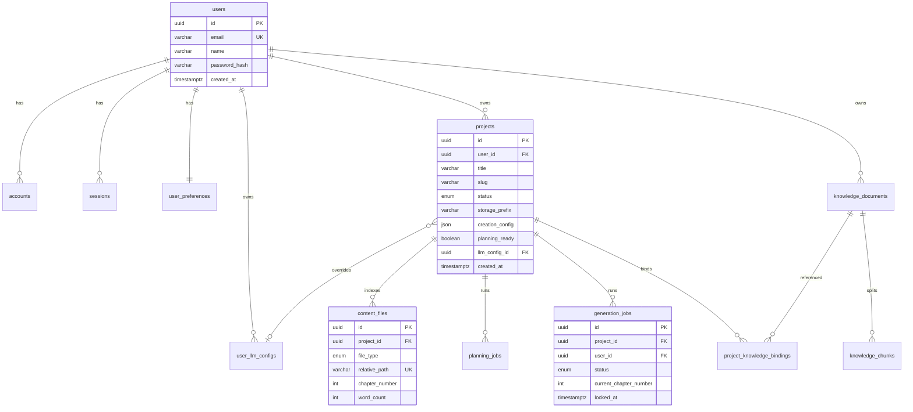
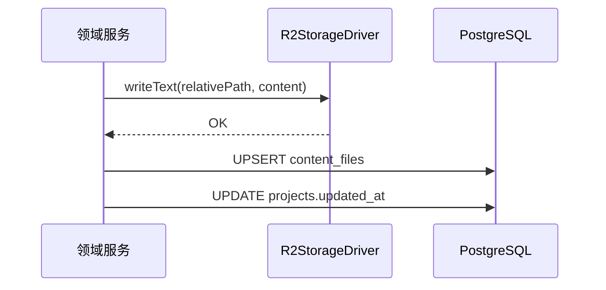

# 数据库设计文档

## 文档信息

| 项 | 内容 |
|----|------|
| 版本 | **1.3.0** |
| 状态 | **已定稿** |
| 定稿日期 | 2026-05-23 |
| 上游 | [requirements.md](./requirements.md) v1.4.0、[design.md](./design.md) v1.4.0 |
| 下游 | [api.md](./api.md)（接口契约）、`drizzle/schema/*`（实现） |
| ORM | Drizzle ORM + PostgreSQL 16.x |
| 迁移目录 | `drizzle/migrations/` |

**范围说明：** 本文定义 PostgreSQL 表结构、枚举、索引、ER 关系、`02-写作计划.json` 逻辑结构及与 DB 的同步策略。**不**将章节正文、人物档案、大纲全文存入数据库（REQ-007）。

---

## 1. 设计原则

| 原则 | 说明 |
|------|------|
| R2 为真源 | 人物/大纲/章节 MD、写作计划 JSON、知识库全文、导出文件存 **Cloudflare R2**；DB 仅存 **R2 对象键**与元数据 |
| 用户隔离 | 所有业务表含 `user_id`；查询必须带 `session.user.id`（等效 RLS，见 design.md §6.2） |
| 无正文 BLOB | 禁止正文 `TEXT` 列存章节；知识库解析全文存 R2（`text_storage_key`） |
| 枚举集中 | 字符串枚举在 `drizzle/schema/enums.ts` 与本文保持一致 |
| 时间戳 | 统一 `created_at`、`updated_at`（UTC，`TIMESTAMPTZ`）；软删可选 `deleted_at` |
| ID | 业务主键 `UUID`（建议 UUID v7/v4）；Auth 表可与 NextAuth 约定一致 |

---

## 2. 逻辑 ER 图



---

## 3. 枚举定义

### 3.1 项目状态 `project_status`（REQ-017）

| 值 | 用户可见 | 说明 |
|----|----------|------|
| `draft` | 草稿 | 向导未完成 |
| `planning` | 规划中 | Phase 2 生成中或待 L4 确认 |
| `writing` | 创作中 | Phase 3 |
| `validating` | 校验中 | Phase 4 |
| `completed` | 已完成 | 可阅读/导出 |

### 3.2 内容文件类型 `content_file_type`

| 值 | 对应文件 |
|----|----------|
| `character` | `00-人物档案.md` |
| `outline` | `01-大纲.md` |
| `writing_plan` | `02-写作计划.json` |
| `chapter` | `第NN章-标题.md` |

### 3.3 章节状态 `chapter_status`（`02-写作计划.json` 内）

| 值 | 说明 |
|----|------|
| `pending` | 未开始 |
| `in_progress` | 创作中 |
| `completed` | 已完成 |
| `failed` | 失败（校验/重写） |

### 3.4 创作节奏 `creation_pace`（REQ-009）

| 值 | 说明 |
|----|------|
| `auto` | 后台连续逐章（Worker） |
| `manual` | 用户按章触发，强制串行 |

### 3.5 写作模式 `writing_mode`（REQ-009）

| 值 | 说明 |
|----|------|
| `serial` | 按章顺序完成 |
| `parallel` | 分批并行，大纲保连贯（仅 `creationPace=auto`） |

### 3.6 后台任务状态 `job_status`

| 值 | 说明 |
|----|------|
| `pending` | 待 Worker 拉取 |
| `running` | 执行中 |
| `completed` | 正常结束 |
| `failed` | 失败（可重试） |
| `cancelled` | 用户取消 |

### 3.7 知识库文档状态 `knowledge_doc_status`

| 值 | 说明 |
|----|------|
| `processing` | 解析中 |
| `ready` | 可检索 |
| `failed` | 解析失败 |

---

## 4. 表清单

| 表名 | 需求 |
|------|------|
| `users` | Auth Credentials |
| `accounts` | OAuth（D2） |
| `sessions` | Database Session |
| `verification_tokens` | 邮箱验证（可选） |
| `user_preferences` | REQ-001 |
| `projects` | REQ-002、017 |
| `content_files` | REQ-007 |
| `planning_jobs` | REQ-008（Phase 2 异步规划） |
| `generation_jobs` | REQ-010、D1 |
| `user_llm_configs` | REQ-014 |
| `knowledge_documents` | REQ-015 |
| `knowledge_chunks` | REQ-015 RAG |
| `project_knowledge_bindings` | REQ-015 |
| `export_records` | REQ-012 导出历史 |

---

## 5. 表结构详述

### 5.1 `users`

扩展 NextAuth 用户；Credentials 用户 `password_hash` 非空。

| 列名 | 类型 | 约束 | 说明 |
|------|------|------|------|
| `id` | `UUID` | PK | 用户 ID |
| `email` | `VARCHAR(255)` | NOT NULL, UNIQUE | 登录邮箱 |
| `email_verified` | `TIMESTAMPTZ` | NULL | 验证时间 |
| `name` | `VARCHAR(120)` | NULL | 显示名 |
| `image` | `VARCHAR(512)` | NULL | 头像 URL |
| `password_hash` | `VARCHAR(255)` | NULL | bcrypt；仅 Credentials |
| `created_at` | `TIMESTAMPTZ` | NOT NULL | |
| `updated_at` | `TIMESTAMPTZ` | NOT NULL | |

**索引：** `UNIQUE(email)`

---

### 5.2 `accounts` / `sessions` / `verification_tokens`

按 [Auth.js Drizzle Adapter](https://authjs.dev/getting-started/adapters/drizzle) 标准四表结构实现；`accounts.provider` 支持 `github`、`google`、`credentials`（若 Adapter 需要）。

> 实现时以 Adapter 官方 schema 为准，本文不重复列全部 OAuth 字段；迁移须与 `lib/auth` 配置同步。

---

### 5.3 `user_preferences`

| 列名 | 类型 | 约束 | 说明 |
|------|------|------|------|
| `user_id` | `UUID` | PK, FK → users | |
| `preferences` | `JSON` | NOT NULL | 见 §8.1 |
| `updated_at` | `TIMESTAMPTZ` | NOT NULL | |

**`preferences` 结构（对齐 `tpl/user-preferences.example.json`）：**

```json
{
  "favoriteGenres": ["奇幻玄幻"],
  "preferredProtagonist": "双主角",
  "preferredPerspective": "第三人称限制视角",
  "preferredTone": "紧张刺激",
  "typicalChapterCount": 20,
  "styleReferences": [],
  "dislikes": [],
  "creationHistory": []
}
```

---

### 5.4 `projects`

| 列名 | 类型 | 约束 | 说明 |
|------|------|------|------|
| `id` | `UUID` | PK | 作品 ID |
| `user_id` | `UUID` | NOT NULL, FK → users | 归属 |
| `title` | `VARCHAR(200)` | NOT NULL | 小说标题（L3 `novelName`） |
| `slug` | `VARCHAR(80)` | NOT NULL | URL/目录用；`[a-z0-9-]+` |
| `status` | `ENUM(project_status)` | NOT NULL, DEFAULT `draft` | 五态 |
| `storage_prefix` | `VARCHAR(512)` | NOT NULL | **R2 对象键前缀**：`{userId}/{projectId}-{slug}/` |
| `creation_config` | `JSON` | NULL | 向导 L0–L3 采集（见 §8.2） |
| `planning_ready` | `BOOLEAN` | NOT NULL, DEFAULT false | 规划产物已生成、待 L4（REQ-002-AC-005） |
| `llm_config_id` | `UUID` | NULL, FK → user_llm_configs | 作品级模型覆盖 |
| `writing_plan_etag` | `VARCHAR(64)` | NULL | `02-写作计划.json` 内容哈希，可选缓存失效 |
| `chapter_completed_count` | `INTEGER` | NOT NULL, DEFAULT 0 | 冗余统计，由同步任务更新 |
| `total_chapters` | `INTEGER` | NULL | 来自写作计划 |
| `created_at` | `TIMESTAMPTZ` | NOT NULL | |
| `updated_at` | `TIMESTAMPTZ` | NOT NULL | |
| `deleted_at` | `TIMESTAMPTZ` | NULL | 软删 |
| `storage_delete_pending` | `BOOLEAN` | NOT NULL, DEFAULT false | 存储删除补偿标记（Q6-A） |

**索引：**

| 名称 | 列 | 用途 |
|------|-----|------|
| `idx_projects_user_status` | `(user_id, status)` | 作品列表、续写卡片 |
| `idx_projects_user_updated` | `(user_id, updated_at DESC)` | 最近更新 |
| `UNIQUE(user_id, slug)` | | 同用户下 slug 唯一 |

**`storage_prefix` 示例：** `550e8400-e29b-41d4-a716-446655440000/7c9e6679-7425-40de-944b-e07fc1f90ae7-starfall/`

**R2 对象键：** **不**包含 bucket 名；Bucket 由 `R2_BUCKET` 配置。完整键 = `storage_prefix` + `relative_path`。

**`content_files` 与 R2 映射：** 每行 `relative_path` 为对象键后缀；完整 R2 键 = `projects.storage_prefix` + `content_files.relative_path`。

---

### 5.5 `content_files`

作品 R2 对象的**索引**（非正文；正文在 R2）。

| 列名 | 类型 | 约束 | 说明 |
|------|------|------|------|
| `id` | `UUID` | PK | |
| `project_id` | `UUID` | NOT NULL, FK → projects | |
| `file_type` | `ENUM(content_file_type)` | NOT NULL | |
| `relative_path` | `VARCHAR(255)` | NOT NULL | R2 对象键后缀，如 `第01章-星落.md` |
| `chapter_number` | `INTEGER` | NULL | 仅 `chapter` 类型 |
| `title` | `VARCHAR(200)` | NULL | 章节标题缓存 |
| `word_count` | `INTEGER` | NULL | 上次统计字数 |
| `created_at` | `TIMESTAMPTZ` | NOT NULL | |
| `updated_at` | `TIMESTAMPTZ` | NOT NULL | |

**索引：**

| 名称 | 列 |
|------|-----|
| `UNIQUE(project_id, relative_path)` | |
| `idx_content_files_project_type` | `(project_id, file_type)` |
| `idx_content_files_project_chapter` | `(project_id, chapter_number)` |

**固定路径（与 `config/paths.ts` 一致）：**

| file_type | relative_path |
|-----------|---------------|
| `character` | `00-人物档案.md` |
| `outline` | `01-大纲.md` |
| `writing_plan` | `02-写作计划.json` |

---

### 5.6 `planning_jobs`

Phase 2 规划生成异步任务（澄清 Q4）。

| 列名 | 类型 | 约束 | 说明 |
|------|------|------|------|
| `id` | `UUID` | PK | |
| `project_id` | `UUID` | NOT NULL, FK → projects | |
| `user_id` | `UUID` | NOT NULL, FK → users | 冗余归属校验 |
| `status` | `ENUM(job_status)` | NOT NULL, DEFAULT `pending` | |
| `locked_at` | `TIMESTAMPTZ` | NULL | Worker 互斥锁 |
| `locked_by` | `VARCHAR(64)` | NULL | Worker 实例 ID |
| `attempt_count` | `INTEGER` | NOT NULL, DEFAULT 0 | |
| `last_error` | `VARCHAR(1024)` | NULL | 英文摘要 |
| `started_at` | `TIMESTAMPTZ` | NULL | |
| `completed_at` | `TIMESTAMPTZ` | NULL | |
| `created_at` | `TIMESTAMPTZ` | NOT NULL | |
| `updated_at` | `TIMESTAMPTZ` | NOT NULL | |

**索引：** `idx_planning_jobs_project_status (project_id, status)`；`idx_planning_jobs_pending (status, created_at)`

**约束：** 同一 `project_id` 在 `pending`/`running` 下至多一条 Job。

---

### 5.7 `generation_jobs`

自动创作（`creationPace: auto`）后台任务；手动模式**不**创建此表记录。

| 列名 | 类型 | 约束 | 说明 |
|------|------|------|------|
| `id` | `UUID` | PK | |
| `project_id` | `UUID` | NOT NULL, FK → projects | |
| `user_id` | `UUID` | NOT NULL, FK → users | 冗余，便于 Worker 校验归属 |
| `status` | `ENUM(job_status)` | NOT NULL, DEFAULT `pending` | |
| `current_chapter_number` | `INTEGER` | NULL | 当前/下一章序号 |
| `locked_at` | `TIMESTAMPTZ` | NULL | Worker 互斥锁 |
| `locked_by` | `VARCHAR(64)` | NULL | Worker 实例 ID |
| `attempt_count` | `INTEGER` | NOT NULL, DEFAULT 0 | Job 级重试 |
| `last_error` | `VARCHAR(1024)` | NULL | 英文错误摘要 |
| `started_at` | `TIMESTAMPTZ` | NULL | |
| `completed_at` | `TIMESTAMPTZ` | NULL | |
| `created_at` | `TIMESTAMPTZ` | NOT NULL | |
| `updated_at` | `TIMESTAMPTZ` | NOT NULL | |

**索引：**

| 名称 | 列 | 用途 |
|------|-----|------|
| `idx_jobs_project_status` | `(project_id, status)` | 进度查询 |
| `idx_jobs_pending` | `(status, created_at)` | Worker 拉取 `pending` |

**约束：** 同一 `project_id` 在 `pending`/`running` 状态下至多一条 Job（应用层 + 可选部分唯一索引）。

---

### 5.8 `user_llm_configs`

| 列名 | 类型 | 约束 | 说明 |
|------|------|------|------|
| `id` | `UUID` | PK | |
| `user_id` | `UUID` | NOT NULL, FK | |
| `name` | `VARCHAR(80)` | NOT NULL | 配置显示名 |
| `base_url` | `VARCHAR(512)` | NOT NULL | OpenAI 兼容 base |
| `encrypted_api_key` | `BYTEA` | NOT NULL | AES-GCM，密钥 `ENCRYPTION_KEY` |
| `model_name` | `VARCHAR(120)` | NOT NULL | |
| `is_default` | `BOOLEAN` | NOT NULL, DEFAULT false | 每用户至多一个 true |
| `last_tested_at` | `TIMESTAMPTZ` | NULL | |
| `created_at` | `TIMESTAMPTZ` | NOT NULL | |
| `updated_at` | `TIMESTAMPTZ` | NOT NULL | |

**索引：** `idx_llm_user_default (user_id, is_default)`

---

### 5.9 知识库（`REQ-015`）

#### `knowledge_documents`

| 列名 | 类型 | 说明 |
|------|------|------|
| `id` | `UUID` PK | |
| `user_id` | `UUID` FK | |
| `title` | `VARCHAR(200)` | |
| `source_type` | `ENUM('upload','url')` | |
| `source_meta` | `JSON` | 文件名、URL 等 |
| `status` | `ENUM(knowledge_doc_status)` | |
| `text_storage_key` | `VARCHAR(512)` | 解析后全文对象键（`{userId}/knowledge/{docId}.txt`） |
| `failure_reason` | `VARCHAR(512)` | 英文 |
| `created_at` / `updated_at` | `TIMESTAMPTZ` | |

#### `knowledge_chunks`

| 列名 | 类型 | 说明 |
|------|------|------|
| `id` | `UUID` PK | |
| `document_id` | `UUID` FK | |
| `chunk_index` | `INT` | |
| `content` | `TEXT` | 分块文本（短片段，非全书） |
| `embedding` | `JSON` | 向量（可选，pgvector 扩展） |

#### `export_records`

| 列名 | 类型 | 说明 |
|------|------|------|
| `id` | `UUID` PK | |
| `project_id` | `UUID` FK | |
| `user_id` | `UUID` FK | |
| `format` | `ENUM('md','txt','pdf','epub')` | |
| `metadata` | `JSON` | 书名、作者、简介等 |
| `storage_key` | `VARCHAR(512)` | 导出文件在 R2 中的完整对象键 |
| `file_size` | `INTEGER` | 字节 |
| `created_at` | `TIMESTAMPTZ` | |

#### `project_knowledge_bindings`

| 列名 | 类型 | 说明 |
|------|------|------|
| `project_id` | `UUID` FK | |
| `document_id` | `UUID` FK | |
| `bound_at` | `TIMESTAMPTZ` | |

**PK：** `(project_id, document_id)`

---

## 6. `02-写作计划.json` 逻辑结构

**存储路径：** `{storage_prefix}02-写作计划.json`  
**权威来源：** 文件（机器可读进度）；`projects.status` 为用户可见五态（不同维度）。

### 6.1 JSON Schema（逻辑）

```json
{
  "version": 1,
  "novelName": "string",
  "projectPath": "string",
  "totalChapters": 20,
  "minWordsPerChapter": 3000,
  "maxWordsPerChapter": 5000,
  "createdAt": "ISO-8601",
  "updatedAt": "ISO-8601",
  "status": "planning | in_progress | completed",
  "writingMode": "serial | parallel",
  "creationPace": "auto | manual",
  "chapters": [
    {
      "chapterNumber": 1,
      "title": "string",
      "filePath": "第01章-标题.md",
      "status": "pending | in_progress | completed | failed",
      "wordCount": 0,
      "wordCountPass": true,
      "retryCount": 0
    }
  ]
}
```

| 字段 | 说明 |
|------|------|
| `status`（根级） | 写作计划文件内工作流状态（对齐 tpl）；**不同于** `projects.status` 五态，见 §6.2 |
| `creationPace` | L4 确认后写入（REQ-009） |
| `wordCountPass` | `false` 表示 M8 保存时字数越界（REQ-013） |
| `filePath` | 与 `content_files.relative_path`、磁盘文件名一致 |

**`writingMode` 有效值：** `serial`（默认）、`parallel`（仅 `creationPace=auto`）。

### 6.2 `projects.status` 与 JSON 的映射

| 触发事件 | `projects.status` | `02-写作计划.json` |
|----------|-------------------|---------------------|
| 新建向导 | `draft` | 可能不存在 |
| 开始 Phase 2 | `planning` | 生成后 `planStatus: planning` |
| 规划完成待 L4 | `planning` + `planning_ready=true` | 根 `status: planning` |
| L4 确认 + 选模式 | `writing` | 根 `status: in_progress`，写入 `creationPace` / `writingMode` |
| 全章 completed | `validating` | 各章 `completed` |
| Phase 4 通过 | `completed` | 根 `status: completed`（若使用） |

---

## 7. R2 真源与 DB 同步策略

### 7.1 写入顺序（REQ-007）

所有 MD/JSON/二进制正文**仅**写入 Cloudflare R2；DB 记录 R2 对象键索引。



章节完成时额外：`02-写作计划.json` 更新该章 `status` / `wordCount` / `wordCountPass`。

### 7.2 读路径

| 场景 | 数据源 |
|------|--------|
| 章节列表 API | `content_files` + `02-写作计划.json` 章节状态合并 |
| 章节正文预览/阅读 | `R2StorageDriver.readText`（键 = `storage_prefix` + `relative_path`） |
| 创作进度（自动） | `generation_jobs` + JSON `chapters[].status` |
| 规划生成中 | `planning_jobs` + `projects.planning_ready` |
| 仪表盘 / 首页卡片 | `projects.status`、`planning_ready` + JSON：`writing`/`validating` 用 `completed/total`；`validating` 文案区分「校验中」 |

### 7.3 同步职责

| 操作 | 更新文件 | 更新 DB |
|------|----------|---------|
| Phase 2 完成 | `00/01/02` 三个文件 | `content_files`×3；`projects.planning_ready=true` |
| 单章写完 | 章节 MD + `01-大纲.md` 摘要区 + JSON 章项 | `content_files` chapter 行；JSON 全量写回 |
| M8 编辑保存 | 章节 MD + JSON 章项 | `content_files.word_count`；`wordCountPass` |
| Phase 4 退回重写 | JSON 章 `failed` | `generation_jobs` 可选新建 |
| 删除作品 | 软删 DB + `storage_delete_pending` → Worker `deletePrefix` | 补偿重试直至成功 |

### 7.4 一致性校验（Worker / 定时）

1. 读取 `02-写作计划.json` 解析章节列表  
2. 对每个 `filePath`：`exists` + 统计 `word_count`  
3. 与 `content_files` 对齐；偏差时以 **R2 对象**为准回写 DB  
4. 更新 `projects.chapter_completed_count`、`writing_plan_etag`

### 7.5 损坏恢复

| 故障 | 策略 |
|------|------|
| JSON 解析失败 | UI 报错 `errors.writingPlanCorrupted`；尝试从 `01-大纲.md` + 章节文件重建章节列表 |
| 章节文件缺失但 JSON 为 completed | 标为 `failed`，触发重写流程 |
| DB 索引缺失但 R2 对象存在 | `list(storage_prefix)` 扫描 R2 前缀补建 `content_files` |

---

## 8. JSON 列结构

### 8.1 `projects.creation_config`

向导与快捷开写采集；L4 前持续合并更新。

```json
{
  "source": "wizard | quick_start",
  "phase0Extract": {},
  "layer1": {
    "genre": "",
    "premise": "",
    "protagonist": {},
    "coreConflict": ""
  },
  "layer2": {
    "worldbuilding": {},
    "perspective": "",
    "tone": "",
    "theme": "",
    "audience": {},
    "chapterCount": 20
  },
  "layer3": {
    "selectedTitle": "",
    "candidates": []
  }
}
```

> 字段名实现时可细化；api.md 定义对外契约。

---

## 9. Drizzle 实现约定

### 9.1 目录结构

```text
drizzle/
├── schema/
│   ├── enums.ts
│   ├── auth.ts          # users, accounts, sessions, verification_tokens
│   ├── projects.ts
│   ├── content-files.ts
│   ├── jobs.ts          # planning_jobs + generation_jobs
│   ├── preferences.ts
│   ├── llm.ts
│   ├── knowledge.ts
│   └── exports.ts
├── index.ts             # 聚合 export
└── migrations/
```

### 9.2 命名与类型

| 约定 | 说明 |
|------|------|
| 表名 | snake_case 复数 |
| TS 导出 | `projects` 表 → `projects` 关系名 `project` |
| JSON 列 | `json('creation_config').$type<CreationConfig>()` 用 Zod 校验边界 |
| 时间 | `timestamp('created_at', { withTimezone: true, mode: 'date' })` |
| 外键 | `onDelete: 'cascade'` 用于 `project_id` 子表 |

### 9.3 迁移策略

1. **初始迁移：** Auth 四表 + 全量业务表（含 `planning_jobs`、知识库、`export_records`）
2. **增量迁移：** 仅 schema 变更时 `drizzle-kit generate` + 审查

---

## 10. 与 api.md 的契约摘要

| 规则 | 说明 |
|------|------|
| 列表不返正文 | `content_files` 仅返 `relativePath`、`chapterNumber`、`status`（来自 JSON） |
| 未登录 | 无 session → 不查库，直接 401 |
| 跨用户 | `project.user_id !== session.user.id` → **404** |
| 进度轮询 | `GET .../planning-jobs/:jobId`、`GET .../generation-jobs/:jobId` |
| 仪表盘跳转 | `status` + `planning_ready` → `resumeHref`（见 api.md §7.1） |

---

## 11. 修订记录

| 版本 | 日期 | 说明 |
|------|------|------|
| 1.0.0 | 2026-05-20 | 初稿定稿；对齐 requirements v1.0.0、design v1.0.0 |
| 1.0.1 | 2026-05-22 | 数据库方案切换至 PostgreSQL |
| 1.2.0 | 2026-05-23 | R2 与 local 双驱动完整实现；对象键约定与 knowledge/export 路径 |
| 1.3.0 | 2026-05-23 | **R2 唯一存储**；DB 字段明确为 R2 对象键；移除本地文件系统 |
| 1.3.1 | 2026-05-23 | 读路径补充规划 Job、仪表盘 `planning_ready` 分流（对齐 requirements/api v1.4.0） |

---

*下游：[api.md](./api.md) 与 PostgreSQL 方案一致；实现见 `drizzle/schema` 迁移。*

