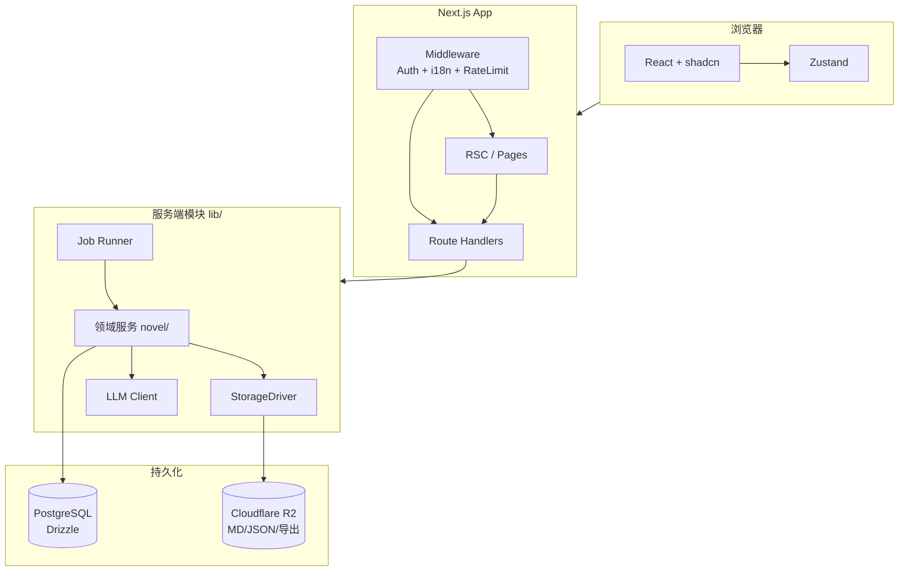
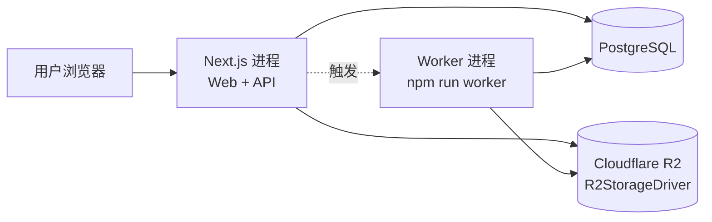
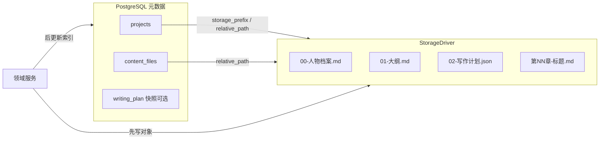
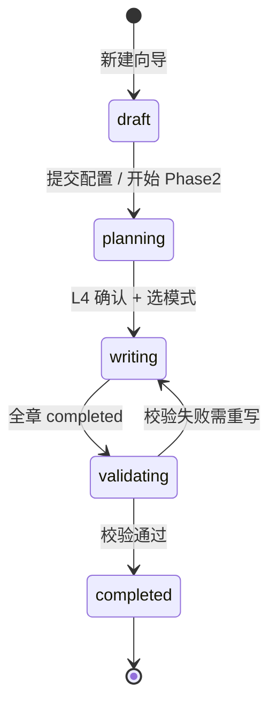
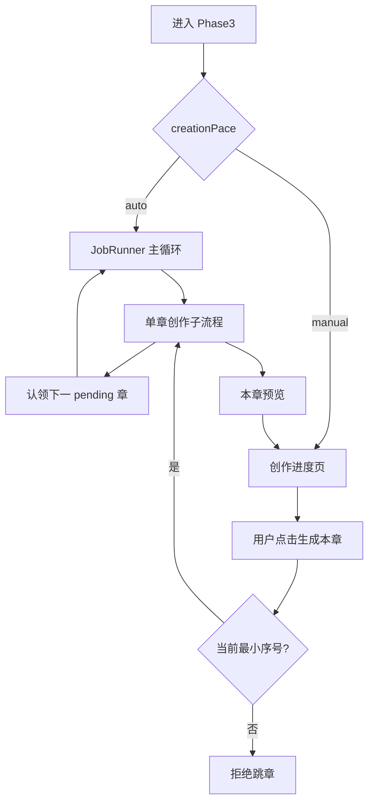
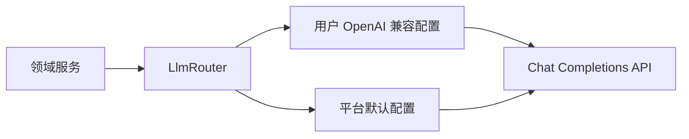
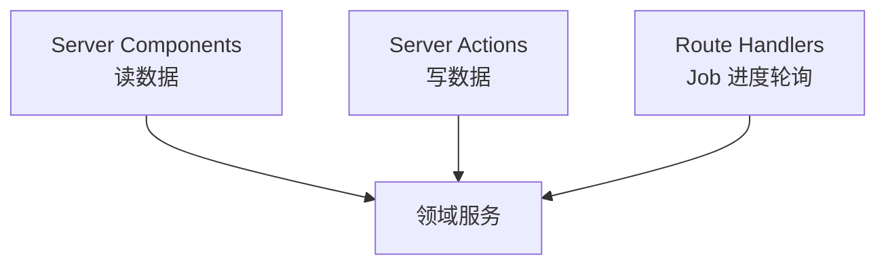
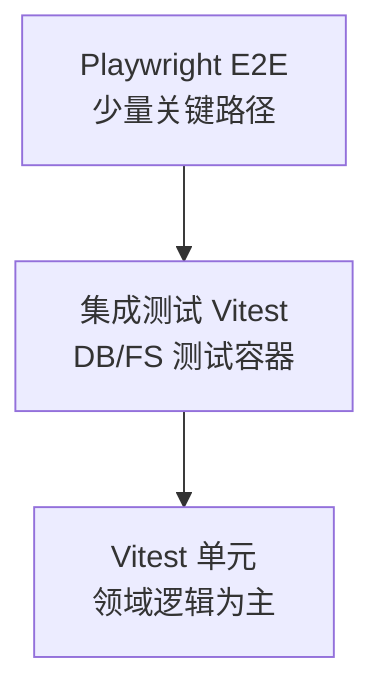
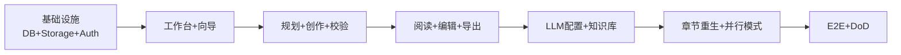

# 技术设计文档

## 文档信息

| 项 | 内容 |
|----|------|
| 版本 | **1.3.0** |
| 状态 | **已定稿**（2026-05-23，R2 唯一对象存储） |
| 上游 | [requirements.md](./requirements.md) v1.3.0、[project.md](../project.md) v2.5 |
| 下游 | [data.md](./data.md)（数据库设计）、[api.md](./api.md)（接口设计）、[tasks.md](./tasks.md) |
| 当前代码基线 | Next.js 16 App Router 脚手架（`app/page.tsx`），业务模块待实现 |

**范围说明：** 本文描述技术架构、模块划分、技术选型与横切关注点。**数据库表结构、字段、索引**见 [data.md](./data.md)；**HTTP API 路径、请求/响应契约**见 [api.md](./api.md)。本文仅引用，不重复展开。

---

## 1. 设计目标与约束

### 1.1 目标

| 目标 | 说明 |
|------|------|
| 对齐需求 | 覆盖 REQ-001 ~ REQ-018 全量及澄清 #1~#5 |
| 文件真源 | 人物/大纲/章节正文以 **Cloudflare R2** 对象为权威副本（REQ-007） |
| 可测试 | 领域逻辑与文件 IO、LLM 调用可单元测试；核心流程可 E2E |
| 全量交付 | 不分期裁剪；并行写作、导出、知识库、章节重生等均在本版架构内实现 |

### 1.2 硬约束（来自需求定稿）

- 项目状态 **5 态**：`draft` / `planning` / `writing` / `validating` / `completed`
- **必须登录** 方可创作；访客仅公开页
- Phase 3：**自动**（`creationPace: auto`）与 **手动**（`creationPace: manual`，强制按序）并存
- 手动编辑字数越界：**警告可保存** + `wordCountPass: false`；自动创作仍硬门槛
- 用户可见错误文案：**英文**；代码注释：**中文**

---

## 2. 技术栈与选型

### 2.1 技术栈总览

| 层级 | 选型 | 版本策略 | 选型理由 |
|------|------|----------|----------|
| 运行时 | Node.js | LTS（≥20） | 与 Next.js 16、工具链兼容 |
| 框架 | **Next.js**（App Router） | 16.x 稳定版 | 已初始化；SSR/Route Handlers/中间件 |
| 语言 | **TypeScript** | 5.x | 项目规范；严格模式 |
| UI | **React** + **shadcn/ui** + **Tailwind CSS** | 稳定版 | 组件一致、可访问性、与现有 Tailwind 4 对齐 |
| 认证 | **NextAuth.js**（Auth.js v5） | 稳定版 | 会话、回调、与 App Router 集成 |
| 数据库 | **PostgreSQL** | 16.x 稳定版 | 关系型元数据、事务、生态成熟 |
| ORM | **Drizzle ORM** | 稳定版 | 类型安全 schema、迁移、轻量 |
| 国际化 | **next-intl** | 稳定版 | App Router 路由级 i18n |
| 客户端状态 | **Zustand** | 稳定版 | 向导多步、创作进度页局部 UI 状态 |
| 作品正文存储 | **`R2StorageDriver`**（Cloudflare R2，S3 兼容 API） | — | 满足 REQ-007；DB 仅存 R2 对象键索引 |
| 单元测试 | **Vitest** + Testing Library | 稳定版 | 项目规范 |
| E2E | **Playwright** | 稳定版 | 项目规范；核心用户旅程 |
| 工程化 | ESLint、Husky、lint-staged、GitHub Actions | 已有/待补 | AGENTS.md 质量基线 |

> **说明：** 禁止使用 beta 包（AGENTS.md）。LLM 调用通过 OpenAI 兼容 HTTP 客户端封装，密钥走环境变量（REQ-014、REQ-018）。

### 2.2 明确不纳入本设计主路径的技术

| 技术 | 说明 |
|------|------|
| Supabase | AGENTS.md 安全示例中的 RLS 思路在 **PostgreSQL + 应用层归属校验（可选原生 RLS）** 中实现，不引入 Supabase |
| 正文字段入库 | 违反 REQ-007，禁止 |

### 2.3 核心依赖关系



---

## 3. 系统架构

### 3.1 逻辑分层

| 层 | 职责 | 目录（规划） |
|----|------|--------------|
| 表现层 | 页面、布局、表单、进度 UI | `app/[locale]/`、`components/` |
| 应用层 | Route Handlers、鉴权入口、DTO 校验 | `app/api/` |
| 领域层 | 项目状态机、Phase 流程、章节创作子流程 | `lib/novel/` |
| 基础设施层 | DB、存储、LLM、任务队列、配置 | `lib/db/`、`lib/storage/`、`lib/ai/`、`lib/jobs/`、`config/` |

**依赖规则：** 表现层 → 应用层 → 领域层 → 基础设施层；领域层不得依赖 React。

### 3.2 部署逻辑视图



| 组件 | 必须 | 说明 |
|------|------|------|
| Next.js Web | 是 | 页面 + API + Server Actions |
| PostgreSQL | 是 | 用户、项目元数据、任务、偏好、知识库索引 |
| 作品存储 | 是 | **Cloudflare R2**（`R2StorageDriver`）；Web 与 Worker 共用同一 `R2_BUCKET` 与凭证 |
| 独立 Worker | 是 | `npm run worker`；消费 `planning_jobs`、`generation_jobs`、存储补偿 |
| Redis | 可选 | 分布式限流、任务锁；默认可用 DB 任务表 + 单 Worker |

### 3.3 与需求模块映射

| 需求 | 领域模块 | 主要技术落点 |
|------|----------|--------------|
| REQ-001 偏好 | `PreferenceService` | PostgreSQL `user_preferences`；见 data.md |
| REQ-002 工作台 | `ProjectService` | PostgreSQL `projects` + 状态枚举 |
| REQ-003 L0 快捷开写 | `QuickStartService` + 向导 Store | Zustand + `ExtractService`(AI) |
| REQ-007 文件真源 | `WorkspaceService` | R2 读写；`content_files` 存 R2 对象键索引 |
| REQ-008~009 规划 | `PlanningService` | AI + 写 `00/01/02` 文件 |
| REQ-010 创作 | `ChapterWriter` + `JobRunner` | 子流程纯函数 + Worker |
| REQ-011 校验 | `ValidationService` | 读 MD 统计字数；更新计划 JSON |
| REQ-012 阅读/导出 | `ReaderService` + `ExportService` | 读 MD 渲染；MD/TXT/PDF/EPUB 管道 |
| REQ-013 编辑 | `EditorService` + `ConsistencyService` | 写回 MD；`wordCountPass`；润色 diff |
| REQ-014 模型 | `ModelConfigService` | 加密存 Key；`LlmRouter` |
| REQ-015 知识库 | `KnowledgeService` | 文档解析 + RAG 片段 + 绑定 |
| REQ-016 章节重生 | `RegenerateService` | 复用 `PlanningService` / `ChapterWriter` |
| REQ-017 状态机 | `ProjectStateMachine` | 集中转换规则 |
| REQ-018 安全 | Middleware + 服务层校验 | 限流、归属、env |

---

## 4. 项目结构（规划）

当前仓库为脚手架，以下为 **目标结构**（按 [tasks.md](./tasks.md) 渐进创建）：

```text
moyu/
├── app/
│   ├── [locale]/                    # next-intl 语言前缀
│   │   ├── (marketing)/             # 访客：首页、落地页
│   │   ├── (auth)/                  # 登录/注册
│   │   └── (app)/                   # 需登录
│   │       ├── dashboard/           # 我的作品
│   │       └── projects/[projectId]/
│   │           ├── wizard/          # L1-L3
│   │           ├── plan/            # L4
│   │           ├── write/           # L5 创作进度
│   │           ├── read/            # 阅读器
│   │           ├── edit/            # M8 编辑
│   │           └── export/          # 成书导出
│   │       ├── knowledge/           # 知识库管理
│   │       └── settings/            # 偏好、AI 模型
│   └── api/                         # Route Handlers → 契约见 api.md
├── components/
│   ├── ui/                          # shadcn
│   └── novel/                       # 业务组件
├── config/                          # 集中配置（AGENTS.md）
│   ├── app.ts
│   ├── novel.ts                     # 字数区间、重试次数等
│   └── paths.ts
├── drizzle/
│   ├── schema/                      # 表定义 → 详见 data.md
│   └── migrations/
├── lib/
│   ├── auth/                        # NextAuth 配置
│   ├── db/                          # Drizzle client
│   ├── storage/                     # R2StorageDriver + 接口抽象（测试 mock）
│   ├── ai/                          # OpenAI 兼容客户端
│   ├── jobs/                        # 任务入队与执行
│   └── novel/                       # 领域服务（按上表）
├── messages/                        # next-intl 文案（en 错误信息等）
├── stores/                          # Zustand：wizardStore、writeProgressStore
├── tpl/                             # 已有：流程与写作模版
├── tests/
│   ├── unit/                        # Vitest
│   └── e2e/                         # Playwright
├── scripts/
│   └── worker.ts                    # 后台创作 Worker 入口
└── docs/spec/
    ├── requirements.md
    ├── design.md                    # 本文
    ├── data.md                      # 已定稿
    └── api.md                       # 已定稿
```

---

## 5. 核心领域设计

### 5.1 双存储模型（REQ-007）



**存储抽象（澄清 D3：R2 唯一真源）：**

```typescript
// lib/storage/types.ts — 领域层依赖此接口；生产唯一实现 R2StorageDriver
interface StorageDriver {
  /** R2 对象键 = storage_prefix + relative_path，不含 leading slash，不含 bucket 名 */
  readText(key: string): Promise<string>;
  writeText(key: string, body: string): Promise<void>;
  readBytes(key: string): Promise<Uint8Array>;
  writeBytes(key: string, body: Uint8Array, contentType?: string): Promise<void>;
  exists(key: string): Promise<boolean>;
  deletePrefix(prefix: string): Promise<void>;
  list(prefix: string): Promise<string[]>;
}
```

| 实现 | 状态 | 说明 |
|------|------|------|
| `R2StorageDriver` | **唯一生产实现** | `@aws-sdk/client-s3` + R2 S3 兼容 endpoint |
| Mock（测试） | Vitest | mock `S3Client`；**不**使用本地文件系统 |

- 工厂：`lib/storage/index.ts` → `createStorageDriver()` **始终**返回 `R2StorageDriver`；`config/storage.ts` 校验 `R2_*` 环境变量
- DB 仅存 R2 对象键（`storage_prefix` + `relative_path` 或完整 `storage_key`），不存正文

| 操作 | 顺序 | 说明 |
|------|------|------|
| 生成/更新正文 | `writeText` → 更新 `content_files` + `projects.updatedAt` | 存储为真源 |
| 生成导出文件 | `writeBytes` → 写入 `export_records.storage_key` | PDF/EPUB 等二进制 |
| 读取章节 | `readText(storage_prefix + relative_path)` | 可短时内存缓存 |
| 读取导出 | `readBytes(storage_key)` | Route Handler 流式下载 |
| 删除作品 | `deletePrefix(storage_prefix)` + 级联删索引 | 失败走 `storage_delete_pending` 补偿 |

**R2 对象键约定（Bucket 由 `R2_BUCKET` 配置，键不含 Bucket 名）：**

```text
{userId}/{projectId}-{slug}/00-人物档案.md
{userId}/{projectId}-{slug}/第01章-标题.md
{userId}/knowledge/{documentId}.txt          # 知识库解析全文
{userId}/exports/{projectId}/{exportId}.pdf  # 导出产物
```

- `projects.storage_prefix` 存 R2 前缀 `{userId}/{projectId}-{slug}/`（trailing slash）
- 完整对象键：`${storage_prefix}${relative_path}`；禁止 `..` 与绝对路径
- API 返回的 `filePath` 即完整 R2 对象键（或等价拼接字段）

#### 5.1.1 R2StorageDriver 实现要点

| 项 | 约定 |
|----|------|
| SDK | `@aws-sdk/client-s3`（稳定版，禁止 beta） |
| Client | `S3Client`；`endpoint = R2_ENDPOINT ?? https://{R2_ACCOUNT_ID}.r2.cloudflarestorage.com`；`region = R2_REGION ?? 'auto'`；`credentials` 来自 `R2_ACCESS_KEY_ID` / `R2_SECRET_ACCESS_KEY` |
| `writeText` | `PutObject`；`ContentType: text/plain; charset=utf-8`（`.md`/`.json` 可细分 MIME） |
| `readText` | `GetObject` → UTF-8 解码 |
| `writeBytes` / `readBytes` | `PutObject` / `GetObject` 二进制；导出 PDF/EPUB 使用 |
| `exists` | `HeadObject`；404 → `false` |
| `list` | `ListObjectsV2` 分页；返回相对 `prefix` 的对象键列表 |
| `deletePrefix` | `ListObjectsV2` + `DeleteObjects` 批量（每批 ≤1000）；循环直至前缀清空 |
| 启动校验 | 缺少任一必填 `R2_*` → Web/Worker 进程启动失败，英文错误日志 |
| 错误映射 | 上游 5xx / 网络错误 → 领域错误 `STORAGE_IO_ERROR`（英文 message）；不向客户端暴露 R2 内部细节 |

**部署约束：** 开发、测试、生产环境均连接 R2；推荐 dev 使用独立 Bucket（如 `muoyu-dev`）。禁止将 MD/JSON 正文写入应用服务器本地磁盘。

> 表字段与 ER 图见 **[data.md](./data.md)**。

### 5.2 项目状态机（REQ-017）



实现：`lib/novel/project-state-machine.ts` 纯函数 `assertTransition(from, to, event)`，非法转换抛业务错误（英文 message key）。

### 5.3 Phase 3 创作节奏（REQ-009、REQ-010）



**单章创作子流程**（自动/手动共用，宜纯函数 + 可单测）：

1. 写前分析（读大纲行、人物、前章摘要、知识库片段）
2. 撰写 → 写 `第NN章-*.md`
3. 张力检查 / 润色（AI）
4. 字数检查；未达标 → 扩充，≤3 轮
5. 写摘要 → `01-大纲.md`
6. 更新 `02-写作计划.json`

模版与规则引用 `tpl/flows/phase3-writing.md`、`tpl/guides/*`。

### 5.4 后台任务（自动创作）

**部署（澄清 D1=A）：** Web 进程只负责入队与查询进度；**独立 Worker 进程**（`scripts/worker.ts`，`package.json` 脚本 `worker`）循环消费任务，与 Next.js 同连 PostgreSQL，经 `createStorageDriver()` 读写作品存储。

| 项 | 设计 |
|----|------|
| 触发（规划） | L3 完成 / 快捷跳规划 → `planning_jobs`（`pending`），Worker 生成 00/01/02 |
| 触发（创作） | L4 确认且 `creationPace=auto` → `generation_jobs`（`pending`） |
| 消费 | Worker 轮询；同项目互斥锁（`locked_at`）避免双写 |
| 并发 | `writingMode: serial` 单章串行；`parallel` 分批并行（REQ-009） |
| 断点续写 | Job 记录 `currentChapter`；Worker 从 `in_progress` / 下一 `pending` 继续 |
| 失败 | 章 `failed` + `retryCount`；超 3 次标异常继续下一章（REQ-010-AC-006） |
| 手动模式 | 不经过 Worker；API 同步或短任务调用 `ChapterWriter`（用户按章触发） |

> 任务表结构见 **[data.md](./data.md)**；启停/状态查询 API 见 **[api.md](./api.md)**。

### 5.5 快捷开写（REQ-003 澄清 #3）

- API/服务：`QuickStartService.extract(description)` → 结构化字段
- UI：提取结果页 + **用户**选择「进入完整向导」或「跳过至规划」
- 跳规划前若无 `novelName` → 先 L3

### 5.6 LLM 调用（REQ-014）



- 密钥：加密存 DB（见 data.md），界面脱敏
- 用途：规划、创作、润色、标题、快捷提取、一致性检查、知识库摘要（全量启用）

---

## 6. 认证与授权

### 6.1 NextAuth 集成

**登录方式（澄清 D2=B）：** 一期同时支持 **Credentials（邮箱+密码）** 与 **OAuth**；OAuth Provider 首期建议 **GitHub + Google**（可配置开关，见 `config/auth.ts`）。

| 项 | 设计 |
|----|------|
| 适配器 | **Auth.js v5 + Drizzle Adapter** — `users`、`accounts`、`sessions`、`verification_tokens`（见 data.md） |
| 会话 | **Database Session**（便于撤销、与 OAuth `accounts` 关联） |
| Credentials | 邮箱注册/登录；密码 **bcrypt** 哈希存 `users.password_hash`（仅 Credentials 用户非空） |
| OAuth | `GitHubProvider`、`GoogleProvider`；`allowDangerousEmailAccountLinking: false`，同邮箱需显式绑定策略（api.md 约定） |
| 页面保护 | `middleware.ts`：`/app/*`、`/api/projects/*` 等需 `auth()` |
| 访客 | `(marketing)` 路由不强制登录；创作 API 返回 401 |
| 登录回跳 | `callbackUrl` 保留原目标（REQ 登录拦截点） |
| 环境变量 | `AUTH_SECRET`、`AUTH_GITHUB_ID/SECRET`、`AUTH_GOOGLE_ID/SECRET`（禁止硬编码，见 AGENTS.md） |

### 6.2 资源归属（应用层优先，兼容 RLS）

一期默认采用 **Repository/Service 层强制归属校验**（即使 PostgreSQL 支持原生 RLS 也先不依赖数据库策略）：

```text
∀ 查询/更新 projects, content_files, knowledge_documents, ...
  WHERE user_id = session.user.id
```

- Route Handler 入口：`requireUser()`  
- 禁止信任客户端传入的 `userId`  
- 跨用户访问返回 404（避免泄露存在性）或 403（按 api.md 约定）

---

## 7. 前端架构

### 7.0 数据获取策略（澄清 D4=C）

| 场景 | 方式 | 说明 |
|------|------|------|
| **读**（列表、详情、章节树） | **RSC + Server Components** | 在 Server Component 内直接调用领域服务 / Repository；`revalidatePath` / `revalidateTag` 失效缓存 |
| **写**（向导提交、保存章节、触发规划） | **Server Actions** | `app/actions/*.ts`；`useFormState` / `useActionState`；校验失败返回英文字段错误 |
| **长任务进度**（自动创作 Job） | **REST 轮询** | `GET /api/projects/[id]/jobs/[jobId]`（见 api.md）；客户端 **Zustand + `setInterval` fetch**，不用 React Query |
| **禁止** | 业务读走客户端 REST 再灌 Zustand 当真源 | 避免双份缓存与 RLS 遗漏 |



### 7.1 路由与国际化（next-intl）

**语言策略（澄清 D5=A）：**

| 项 | 约定 |
|----|------|
| 默认 locale | **`zh`**（`defaultLocale: 'zh'`，`localePrefix: 'always'`） |
| 界面文案 | `messages/zh.json` — 中文 UI |
| 错误/校验文案 | **始终英文** — `messages/en.json` 的 `errors.*` 命名空间；Server Actions / API 返回 `errorKey`，客户端用 `tErrors(errorKey)` 解析（与用户当前 UI locale 无关） |
| 可选英文 UI | `/en/...` + `messages/en.json` 完整翻译（P2 可渐进） |

| 模式 | 路径示例 | 说明 |
|------|----------|------|
| 默认 | `/zh/dashboard` | 未带 locale 时重定向至 `/zh` |
| 英文 UI | `/en/dashboard` | 可选第二语言界面 |
| 配置 | `middleware` 合并 auth + intl | 避免重复重定向；`config/app.ts` 导出 `locales`、`defaultLocale` |

### 7.2 状态划分

| 状态类型 | 工具 | 示例 |
|----------|------|------|
| 服务端数据 | **RSC**（读）、**Server Actions**（写） | 作品详情、章节列表、向导提交 |
| 多步向导草稿 | **Zustand** `wizardStore` | L1-L3 步骤、提取结果（未提交前） |
| 创作进度轮询 | **Zustand** + REST 定时 fetch | 仅 `creationPace: auto` 的 Job 进度 |
| URL 可分享状态 | `searchParams` | 当前章 `?chapter=3` |

**原则：** 业务真源不在 Zustand；仅 UI 草稿与 Job 轮询快照。

### 7.3 UI 组件

- 基础组件：`components/ui/*`（shadcn CLI 生成）
- 业务：`components/novel/*`（向导步、大纲表、进度条、阅读器）
- 披露层级 L0-L5 对应页面/折叠区（requirements §5）

---

## 8. 配置管理（config/）

| 文件 | 内容 |
|------|------|
| `config/app.ts` | 站点名、`defaultLocale: 'zh'`、`locales: ['zh','en']`、分页 |
| `config/novel.ts` | `MIN_WORDS=3000`、`MAX_WORDS=5000`、`MAX_RETRY=3`、`QUICK_START_MIN_CHARS=20` |
| `config/paths.ts` | 作品文件名常量（`00-人物档案.md` 等） |
| `config/storage.ts` | `R2_*` 环境变量读取与校验 |
| `lib/storage/index.ts` | `createStorageDriver()` 工厂 |
| 环境变量 | 见下表；**禁止硬编码密钥** |

| 变量 | 必填条件 | 用途 |
|------|----------|------|
| `DATABASE_URL` | 始终 | PostgreSQL 连接 |
| `AUTH_SECRET` | 始终 | NextAuth |
| `R2_ACCOUNT_ID` | 是 | Cloudflare 账户 ID |
| `R2_ACCESS_KEY_ID` | 是 | R2 API 令牌 Access Key |
| `R2_SECRET_ACCESS_KEY` | 是 | R2 API 令牌 Secret |
| `R2_BUCKET` | 是 | 目标 Bucket 名称 |
| `R2_ENDPOINT` | 否 | 默认 `https://{R2_ACCOUNT_ID}.r2.cloudflarestorage.com` |
| `R2_REGION` | 否 | S3 客户端 region，默认 `auto`（R2 推荐） |
| `PLATFORM_LLM_*` | 始终 | 平台默认模型 |
| `ENCRYPTION_KEY` | 始终 | 用户 API Key 加密 |
| `RATE_LIMIT_*` | 否 | 限流参数 |

---

## 9. 数据与接口（引用）

| 文档 | 内容 | 状态 |
|------|------|------|
| **[data.md](./data.md)** | ER 图、表结构、Drizzle schema 约定、存储键约定 | **v1.2.0 已定稿** |
| **[api.md](./api.md)** | REST/Route Handler 列表、请求/响应、错误码、鉴权 | **v1.2.0 已定稿** |

**设计层已约定的跨文档契约（写入 data/api 时需保持一致）：**

- `projects.status` ∈ `draft | planning | writing | validating | completed`
- `02-写作计划.json` 含 `creationPace`、`writingMode`、`chapters[].wordCountPass`
- 列表接口返回 `filePath`，**不**内嵌章节全文（REQ-007-AC-004）
- 未登录 → HTTP **401**，文案英文

---

## 10. 测试策略

### 10.1 测试金字塔



### 10.2 单元测试（Vitest）

| 范围 | 示例 |
|------|------|
| 状态机 | `draft → planning` 非法事件拒绝 |
| 手动模式 | 非当前最小序号章拒绝生成 |
| 字数策略 | 自动模式未达标不可 `completed`；编辑警告路径 |
| 写作计划 | 解析/更新 `02-写作计划.json` |
| Workspace / Storage | R2 mock S3Client；读写 MD/JSON/二进制 fixture |
| AI | `LlmRouter` mock，不测真实 API |

**工具：** `@testing-library/react` 测组件；`vi.mock` 隔离 FS/DB。

### 10.3 E2E（Playwright）

| 优先级 | 场景 | 对应需求 |
|--------|------|----------|
| P0 | 登录 → 完整向导 → 规划确认 → 自动创作 → 校验 → 阅读 → 导出 | 主路径 |
| P0 | 手动模式：按序生成本章 | 澄清 #1 |
| P1 | 快捷开写二选一 | 澄清 #3 |
| P1 | 知识库绑定 + 章节重生 | REQ-015、REQ-016 |
| P1 | 编辑、润色、一致性检查 | REQ-013 |

- 配置：Chromium 为主；CI 可选 Firefox/WebKit（AGENTS.md）
- 测试数据：见未来 `seed.md`；E2E 使用独立 DB + 独立 R2 dev Bucket（或 mock）
- 视觉回归：涉及 UI 任务时可用 Playwright MCP 做对比（AGENTS.md）

### 10.4 CI（GitHub Actions）

| 阶段 | 命令 |
|------|------|
| 静态检查 | `tsc --noEmit`、`eslint` |
| 单元测试 | `vitest run` |
| E2E | `playwright test`（可选仅 main PR） |
| 迁移 | `drizzle-kit migrate` 于部署前 |

---

## 11. 安全性

| 威胁 | 措施 | 需求 |
|------|------|------|
| 未授权访问 | NextAuth + 中间件 + Service 层 `userId` 过滤 | REQ-002、REQ-018 |
| 水平越权 | 所有 project 查询带 `userId` | 澄清 #4 |
| API 密钥泄露 | 环境变量 + 加密存储 + 日志脱敏 | REQ-014、REQ-018 |
| 速率滥用 | 全 API  IP 限流 100 次/小时（可配置） | AGENTS.md |
| 路径遍历 | `WorkspaceService` 规范化路径，禁止 `..` | REQ-007 |
| 文件上传 | 知识库 MIME/大小白名单 | REQ-015 |
| LLM 注入 | 模版化 prompt；用户输入转义；输出校验 | 通用 |
| 错误信息 | 英文对外；不暴露 stack | REQ-018-AC-004 |

**限流实现：** `middleware` 或 Route Handler 包装器 + 内存/DB 计数；生产可升级 Redis。

---

## 12. 全量实施顺序（与 tasks.md 对齐）



| 顺序 | 模块 | 需求 |
|------|------|------|
| 1 | 工程基线、config、CI | REQ-018 |
| 2 | Drizzle 全表、R2StorageDriver、状态机 | REQ-007、017 |
| 3 | Auth、中间件、限流 | REQ-001、018 |
| 4 | 偏好、作品 CRUD | REQ-001、002 |
| 5 | 向导 L0–L3、快捷开写 | REQ-003~006 |
| 6 | 规划 Job、L4、创作 Worker | REQ-008~010 |
| 7 | Phase 4 校验、阅读器 | REQ-011、012 |
| 8 | 编辑器、润色、一致性 | REQ-013 |
| 9 | 四格式导出 | REQ-012 |
| 10 | 用户 LLM 配置 | REQ-014 |
| 11 | 知识库 RAG | REQ-015 |
| 12 | 章节重生、并行写作 | REQ-016、009 |

---

## 13. 设计澄清决议（已定稿）

| # | 优先级 | 决议 |
|---|--------|------|
| D1 | P0 | **A** — Next.js Web + 独立 `npm run worker` + `generation_jobs` |
| D2 | P0 | **B** — Credentials + OAuth（GitHub、Google）；Drizzle Adapter + Database Session |
| D3 | P1 | **C** — **R2 唯一**对象存储；`StorageDriver` 接口 + `R2StorageDriver` 实现（S3 兼容） |
| D4 | P1 | **C** — 读 RSC；写 Server Actions；Job 进度 REST + Zustand |
| D5 | P1 | **A** — 默认 locale `zh`；错误/校验文案英文（`messages/en.json` `errors.*`） |

**下一阶段：**（可选）[tasks.md](./tasks.md) 任务拆分；进入 `drizzle/schema` 与基础设施实现。

---

## 修订记录

| 版本 | 日期 | 说明 |
|------|------|------|
| 0.1 | 2026-05-20 | 初稿，基于 requirements v1.0.0 与指定技术栈 |
| 0.1.1 | 2026-05-20 | 澄清 D1：独立 Worker 进程（必须） |
| 0.1.2 | 2026-05-20 | 澄清 D2：Credentials + OAuth（GitHub、Google） |
| 0.1.3 | 2026-05-20 | 澄清 D3：StorageDriver + local 默认，预留 R2 |
| 0.1.4 | 2026-05-20 | 澄清 D4：RSC 读 + Server Actions 写 + Job REST 轮询 |
| 1.0.0 | 2026-05-20 | 澄清 D5；设计定稿，进入 data.md / api.md |
| 1.0.1 | 2026-05-22 | 数据库方案由 MySQL 调整为 PostgreSQL |
| 1.1.0 | 2026-05-23 | 全量交付策略；补充 export/knowledge 路由 |
| 1.2.0 | 2026-05-23 | R2StorageDriver 完整实现规范；扩展 StorageDriver 二进制读写 |
| 1.3.0 | 2026-05-23 | **R2 唯一存储**；移除 LocalStorageDriver；库仅存 R2 对象键 |

---

*下游文档：[data.md](./data.md)、[api.md](./api.md) 按 PostgreSQL 方案对齐。*
