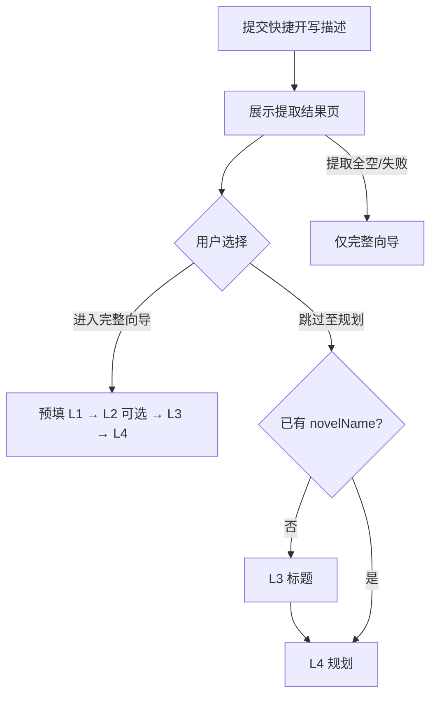

# 需求文档

## 介绍

本文档基于 [docs/project.md](../project.md)（PRD v2.5）展开，采用 **EARS**（简易需求语法）描述验收标准。句式为：**在** \<可选前置条件\> **下，当** \<可选触发器\> **时，** \<系统名称\> **应** \<系统响应\>。范围覆盖 AI 中文小说生成网站从「新建作品」到「完稿导出」的全链路，**重点突出各 Phase 的业务流程、实现步骤、产出物与 Markdown/JSON 模版**。

**系统名称（EARS 中统一使用）：** 摸鱼小说系统

**依据与引用：**

| 类型 | 路径 |
|------|------|
| 产品 PRD | `docs/project.md` |
| 流程细则 | `tpl/flows/phase0-initialization.md` ~ `phase4-validation.md`、`shared-infrastructure.md` |
| 写作模版 | `tpl/guides/outline-template.md`、`character-template.md`、`chapter-template.md` 等 |
| 创作三法则 | `tpl/SKILL.md` |

**内容持久化铁律（贯穿全需求）：**

- 人物档案、大纲、章节正文的**权威副本**为作品目录内的 Markdown 文件
- 数据库仅保存 `workspacePath`、`relativePath`、`status`、`wordCount` 等**路径与元数据索引**，不得将长篇正文写入 BLOB/TEXT 字段

**披露层级（L0–L5）与 Phase 映射：**

| 层级 | Phase | 用户参与 |
|------|-------|----------|
| L0 | Phase 0 | 可选快捷输入 / 续写 |
| L1 | Phase 1 Layer1 | 必答 Q1–Q3 |
| L2 | Phase 1 Layer2 | 可选 Q4–Q8，可跳过 |
| L3 | Phase 1 Layer3 | 必选标题 |
| L4 | Phase 2 + 2.5 | 须确认规划与写作模式 |
| L5 | Phase 3 + 4 | 自动模式：零打扰仅进度与异常；手动模式：按章触发与预览 |

**项目状态（用户可见 5 态，澄清 #2）：**

「规划中」与「待确认规划」合并为同一用户态 **规划中**；规划生成中与规划已出待确认，均使用 `status: planning`，不在用户侧区分。

| 用户可见状态 | `status` 枚举 | 含义 |
|--------------|---------------|------|
| 草稿 | `draft` | 向导未完成 |
| 规划中 | `planning` | Phase 2 生成中，或规划已出待用户确认（L4） |
| 创作中 | `writing` | Phase 3 执行中 |
| 校验中 | `validating` | Phase 4 执行中 |
| 已完成 | `completed` | 可阅读 / 编辑 / 导出 |

**用户角色与认证（澄清 #4）：**

| 角色 | 说明 |
|------|------|
| 访客（未登录） | 仅可访问公开/营销页；**不得**创建作品、使用快捷开写、查看「我的作品」或调用创作类 API |
| 注册用户（已登录） | 可使用全部创作、阅读、编辑、导出与设置能力；作品与知识库归属 `userId` |

**登录拦截点（一期 MVP）：** 新建作品、快捷开写、作品列表、续写、向导 L0–L5、知识库、AI 模型设置——均需已登录；未登录访问上述能力时跳转登录页（登录成功后回跳原目标 URL，实现见技术方案）。

---

## 需求

### 需求 REQ-001 - 账户与偏好记忆

**用户故事：** 作为注册用户，我希望登录后系统记住我的题材与风格偏好，以便新建作品时向导自动预填并减少重复选择。

#### 验收标准

- id: REQ-001-AC-001  
  ears: 在用户已登录的前提下，当用户完成 Phase 1 Layer1 或 Layer2 时，摸鱼小说系统应静默更新用户偏好存储，且无需用户显式点击保存。

- id: REQ-001-AC-002  
  ears: 在用户偏好已存在的前提下，当用户打开创作向导时，摸鱼小说系统应预填适用字段，并对偏好选项做可视化标记（如 ⭐）。

- id: REQ-001-AC-003  
  ears: 在用户处于偏好设置页的前提下，当用户重置偏好时，摸鱼小说系统应恢复默认值，并在下一次向导会话中生效。

- id: REQ-001-AC-004  
  ears: 当未登录用户尝试访问注册/登录、偏好、作品列表以外的创作类功能（含新建、快捷开写、向导、规划、创作进度）时，摸鱼小说系统应拒绝服务并跳转登录页，且不得创建 `userId` 或作品目录。

**实现步骤：**

1. 用户注册/登录后建立 `userId` 与作品归属关系
2. L1/L2 提交时解析字段（题材、视角、基调等），合并写入账户级偏好 JSON（结构参照 `tpl/user-preferences.example.json`）
3. 向导加载时读取偏好，排序选项并预填
4. 设置页提供查看、编辑、重置偏好

**模版/数据：** `tpl/user-preferences.example.json`；规则见 `tpl/flows/shared-infrastructure.md`

---

### 需求 REQ-002 - 项目工作台与作品目录

**用户故事：** 作为作者，我希望在「我的作品」中查看全部项目状态并一键续写未完成作品，且每部作品有独立目录存放所有创作文件。

#### 验收标准

- id: REQ-002-AC-001  
  ears: 在用户已登录的前提下，当用户打开作品列表时，摸鱼小说系统应仅展示当前用户拥有的项目，且状态为草稿 / 规划中 / 创作中 / 校验中 / 已完成之一。

- id: REQ-002-AC-002  
  ears: 在至少存在一个 `status` 为 `writing` 或 `validating` 项目的前提下，当用户进入首页时，摸鱼小说系统应展示续写入口及章节进度信息（如「12/20 章」）。

- id: REQ-002-AC-005  
  ears: 在至少存在一个 `status` 为 `planning` 且规划产物已就绪的项目的前提下，当用户进入首页或作品列表时，摸鱼小说系统应展示「继续确认规划」类入口（跳转 L4），且不得展示章节写作进度式续写文案。

- id: REQ-002-AC-003  
  ears: 当用户新建作品时，摸鱼小说系统应分配唯一作品目录，并在数据库中持久化 `workspacePath`，且不得将小说正文存入数据库正文列。

- id: REQ-002-AC-004  
  ears: 当用户 A 试图访问用户 B 的作品时，摸鱼小说系统应拒绝访问。

- id: REQ-002-AC-006  
  ears: 当未登录用户请求作品列表或作品详情 API 时，摸鱼小说系统应返回未授权响应（HTTP 401 或等价），且不得返回任何作品数据。

**实现步骤：**

1. 新建作品时生成作品目录（命名约定：`{timestamp}-{小说标题}/`，与 Skill 对齐）
2. 数据库 `projects` 表保存 `id`、`userId`、`title`、`workspacePath`、`status`、时间戳
3. 列表页按 5 态筛选；首页：`writing`/`validating` → 续写卡片；`planning`（规划已就绪）→ 继续确认规划入口
4. 所有 API 校验 `userId` 与 `project.userId` 一致；`projects.status` 使用上表枚举值

**作品目录结构（概念）：**

```text
{作品目录}/
├── 00-人物档案.md
├── 01-大纲.md
├── 02-写作计划.json
├── 第01章-章节标题.md
├── 第02章-章节标题.md
└── …
```

---

### 需求 REQ-003 - Phase 0 初始化与快捷开写（L0）

**用户故事：** 作为用户，我希望在首页用一段话描述创作意图后，由系统提取要素并让我**自行选择**进入完整向导或跳过至规划，也可从上次中断处继续创作。

#### 验收标准

- id: REQ-003-AC-001  
  ears: 当已登录用户进入首页时，摸鱼小说系统应在 L0 提供新建作品、续写进行中项目、快捷开写文本输入三项能力。

- id: REQ-003-AC-010  
  ears: 当未登录用户进入首页时，摸鱼小说系统应仅展示公开内容与登录/注册入口，且不得展示需归属用户的续写卡片、作品列表或可调用的快捷开写提交控件。

- id: REQ-003-AC-002  
  ears: 在用户存在 `status` 为 `writing` 或 `validating` 项目的前提下，当用户选择续写时，摸鱼小说系统应跳转至 L5 创作进度页，且不得重新执行 Phase 1。

- id: REQ-003-AC-003  
  ears: 当用户提交快捷开写描述（非空，建议最少 20 字，实现可配置）时，摸鱼小说系统应调用提取逻辑生成题材、主角、冲突等字段，并展示可编辑的提取结果页，**不**基于「充足创作要素」做自动路由判定。

- id: REQ-003-AC-004  
  ears: 当提取结果页展示时，摸鱼小说系统应提供两个显式操作：「进入完整向导」与「跳过至规划」，由用户选择路径，不得在未获用户选择前自动跳转。

- id: REQ-003-AC-005  
  ears: 当用户选择「进入完整向导」时，摸鱼小说系统应将提取结果预填至 L1 相应字段，并从 L1 开始逐步向导（L2 可跳过，L3 标题必选），不得静默跳过 L1。

- id: REQ-003-AC-006  
  ears: 当用户选择「跳过至规划」时，摸鱼小说系统应持久化已确认的提取结果作为创作配置；若尚无 `novelName`，须先完成 L3 标题选择，再进入 L4 规划，不得在未具备标题时启动 Phase 2。

- id: REQ-003-AC-007  
  ears: 当提取结果中题材、主角、冲突均为空或提取失败时，摸鱼小说系统应仅展示「进入完整向导」或自动进入完整向导，且不得展示「跳过至规划」按钮。

- id: REQ-003-AC-008  
  ears: 当用户选择继续 `status` 为 `planning` 且规划已就绪的项目时，摸鱼小说系统应跳转至 L4 规划确认页，而非 L5 创作进度页。

- id: REQ-003-AC-009  
  ears: 在用户偏好已加载的前提下，当 Phase 0 初始化时，摸鱼小说系统应按 `tpl/flows/phase0-initialization.md` 应用偏好规则。

**快捷开写路由（澄清 #3，可测试）：**



**实现步骤：**

1. 检测 `writing` / `validating` → 续写入口；`planning`（规划已就绪）→ 继续确认规划（REQ-002-AC-005）
2. 快捷开写：提取 → 结果页（可编辑）→ 用户二选一，**不做「充足」自动判定**
3. 「跳过至规划」：保存配置 → 无标题则 L3 → L4；「进入完整向导」：预填 L1 走标准向导
4. 提取失败：仅完整向导路径
5. 加载账户偏好，个性化欢迎语与默认项

**流程文档：** `tpl/flows/phase0-initialization.md`

---

### 需求 REQ-004 - Phase 1 Layer1 核心三问（L1）

**用户故事：** 作为作者，我希望逐步回答题材、主角与核心冲突三问，以便系统获得创作最小必要信息。

#### 验收标准

- id: REQ-004-AC-001  
  ears: 当用户进入完整向导路径时，摸鱼小说系统应将 Q1 题材与创意、Q2 主角、Q3 核心冲突分步呈现，且遵循「一屏一事」原则。

- id: REQ-004-AC-002  
  ears: 当用户完成 Q1–Q3 时，摸鱼小说系统应持久化创作配置，并按 REQ-001 更新用户偏好。

- id: REQ-004-AC-003  
  ears: 在用户处于任意 L1 步骤的前提下，当用户选择随机生成时，摸鱼小说系统应为当前问题填充符合题材的随机内容，供用户编辑。

- id: REQ-004-AC-004  
  ears: 在用户处于 L1 某步的前提下，当用户返回上一步时，摸鱼小说系统应保留已填写的答案。

**实现步骤：**

| 步骤 | 问题 | 采集字段 |
|------|------|----------|
| 1 | Q1 题材与创意 | 题材、创意概要 |
| 2 | Q2 主角 | 主角类型、职业/身份、核心性格、关键配角（可选） |
| 3 | Q3 核心冲突 | 冲突类型、驱动力 |

1. 每步 UI：选项 + 自由描述 + 🎲 随机（P1）
2. 提交后写入项目创作配置（JSON/库表短字段，非 Markdown 正文）
3. 完成后进入 L2 或允许跳过 L2

**流程文档：** `tpl/flows/phase1-layer1-core.md`

---

### 需求 REQ-005 - Phase 1 Layer2 深度定制（L2）

**用户故事：** 作为有经验的作者，我希望可选填写世界观、视角、主题等深度设定，或直接跳过使用默认值。

#### 验收标准

- id: REQ-005-AC-001  
  ears: 当用户进入 L2 时，摸鱼小说系统应将 Q4–Q8 置于可折叠的「高级选项」区域，并提供跳过整层选项。

- id: REQ-005-AC-002  
  ears: 当用户跳过 L2 时，摸鱼小说系统应按题材应用默认值，包括章节数及每章 3000–5000 字。

- id: REQ-005-AC-003  
  ears: 当用户在 Q4 选择都市题材时，摸鱼小说系统可按产品规则默认跳过世界观相关问题。

- id: REQ-005-AC-004  
  ears: 当用户完成或跳过 L2 时，摸鱼小说系统应在进入 L3 前展示配置汇总供用户确认。

**实现步骤：**

| 步骤 | 问题 | 字段 | 备注 |
|------|------|------|------|
| 4 | Q4 世界观 | 世界背景、独特规则 | 都市可默认跳过 |
| 5 | Q5 视角与基调 | 叙事视角、整体基调 | |
| 6 | Q6 核心主题 | 主题 | |
| 7 | Q7 读者定位 | 目标读者、风格参考 | 风格参考可跳过 |
| 8 | Q8 章节规模 | 章节数、特殊要求 | 默认每章 3000–5000 字 |

**流程文档：** `tpl/flows/phase1-layer2-customize.md`

---

### 需求 REQ-006 - Phase 1 Layer3 标题生成（L3）

**用户故事：** 作为作者，我希望从系统生成的多个标题候选中选择或自定义书名，作为作品与目录命名依据。

#### 验收标准

- id: REQ-006-AC-001  
  ears: 当用户进入 L3 时，摸鱼小说系统应依据创作配置及 `tpl/guides/title-guide.md` 技法生成 3–5 个标题候选。

- id: REQ-006-AC-002  
  ears: 当用户选择或输入标题时，摸鱼小说系统应将 `novelName` 绑定至作品目录、大纲文件头及写作计划 JSON。

- id: REQ-006-AC-003  
  ears: 在用户处于 L3 的前提下，当用户请求重新生成标题时，摸鱼小说系统应生成新候选集，且不得丢失其他创作配置。

**实现步骤：**

1. 调用 LLM 按标题技法生成候选列表
2. 用户选择其一或输入自定义标题
3. 持久化 `title` / `novelName`；若作品目录尚未创建，以标题参与目录命名
4. 进入 L4 规划阶段

**流程文档：** `tpl/flows/phase1-layer3-title.md`  
**指南：** `tpl/guides/title-guide.md`

---

### 需求 REQ-007 - 内容持久化与文件真源

**用户故事：** 作为平台与用户，我希望人物、大纲、章节均以 Markdown 文件存储便于导出与二次编辑，数据库只做索引。

#### 验收标准

- id: REQ-007-AC-001  
  ears: 当系统生成人物档案、大纲或章节正文时，摸鱼小说系统应将内容写入作品目录下约定的 Markdown 文件，且数据库仅更新路径类元数据。

- id: REQ-007-AC-002  
  ears: 当用户在线阅读或导出章节时，摸鱼小说系统应从对应 `.md` 文件加载内容，而非从数据库正文字段读取。

- id: REQ-007-AC-003  
  ears: 当用户在 M8 保存编辑或确认 AI 润色时，摸鱼小说系统应写回该章 `.md` 文件，并更新文件索引时间戳。

- id: REQ-007-AC-004  
  ears: 当作品详情接口返回章节列表时，摸鱼小说系统应包含 `filePath` 或等价路径字段，且不得内嵌章节全文（专用预览/下载接口除外）。

**实现步骤：**

1. 写路径：生成/更新 → **先写文件** → 再更新 `content_files` 索引（`fileType`, `relativePath`, `chapterNumber`, `updatedAt`）
2. 读路径：按 `workspacePath` + `relativePath` 读文件；可选短时缓存
3. 删除作品：删除或归档整个作品目录并清理索引
4. 例外：创作配置、偏好、知识库绑定等短 JSON 可存库

**产出物与模版对照：**

| 产出物 | 存储形式 | 模版 | 生成阶段 |
|--------|----------|------|----------|
| `00-人物档案.md` | Markdown | `tpl/guides/character-template.md` | Phase 2 |
| `01-大纲.md` | Markdown | `tpl/guides/outline-template.md` | Phase 2；摘要 Phase 3 追加 |
| `02-写作计划.json` | JSON | `tpl/flows/shared-infrastructure.md` | Phase 2 |
| `第NN章-标题.md` | Markdown | `tpl/guides/chapter-template.md` | Phase 3 / M11 |

---

### 需求 REQ-008 - Phase 2 规划生成（人物·大纲·写作计划）

**用户故事：** 作为作者，我希望系统在确认配置后自动生成人物档案、章节大纲与写作计划，并在确认前预览摘要。

#### 验收标准

- id: REQ-008-AC-001  
  ears: 当 L3 标题确认后 Phase 2 启动时，摸鱼小说系统应创建作品目录，并按模版生成 `00-人物档案.md`、`01-大纲.md`、`02-写作计划.json`。

- id: REQ-008-AC-002  
  ears: 当生成 `01-大纲.md` 时，摸鱼小说系统应为每一规划章节填充 7 列表格（章节、标题、核心事件、承接上章、章首引子类型、悬念钩子、出场人物、场景列表）。

- id: REQ-008-AC-003  
  ears: 当生成 `02-写作计划.json` 时，摸鱼小说系统应将各章 `status` 设为 `pending`，且 `filePath` 为 `第NN章-{title}.md`，与作品目录命名约定一致。

- id: REQ-008-AC-004  
  ears: 当规划生成完成时，摸鱼小说系统应将项目 `status` 保持为 `planning`，并默认展示前 5 章摘要与基本信息，完整大纲可折叠展开，等待用户在 L4 确认。

- id: REQ-008-AC-005  
  ears: 当作品已绑定参考文档（M10）时，摸鱼小说系统应按 REQ-015 将检索片段注入 Phase 2 生成上下文。

- id: REQ-008-AC-006  
  ears: 当用户尚未确认规划时，摸鱼小说系统不得启动 Phase 3 自动创作。

**实现步骤：**

| 序号 | 步骤 | 产出 | 模版/指南 |
|------|------|------|-----------|
| 1 | 创建/绑定作品目录 | `workspacePath` | `phase2-planning.md` §1 |
| 2 | 生成人物档案 | `00-人物档案.md` | `character-template.md` + `character-building.md` |
| 3 | 生成章节大纲 | `01-大纲.md` | `outline-template.md` + `plot-structures.md` |
| 4 | 生成写作计划 | `02-写作计划.json` | `shared-infrastructure.md` |
| 5 | 展示规划摘要，等待用户确认 | UI L4 | — |
| 6 | 用户确认后进入 Phase 2.5 | `writingMode` | REQ-009 |

**`01-大纲.md` 结构（模版要点）：**

```markdown
# [小说名称] 大纲
## 基本信息
## 章节规划
| 章节 | 标题 | 核心事件 | 承接上章 | 章首引子类型 | 悬念钩子 | 出场人物 | 场景列表 |
## 全书悬念线
## 章节摘要
### 第N章：标题
**摘要**：（Phase 3 每章完成后追加 300–500 字）
```

**`00-人物档案.md` 结构（模版要点）：** 主角/反派/配角分节，含性格、缺陷、口吻、背景等可指导写作的字段（见 `character-template.md`）。

**`02-写作计划.json` 逻辑结构（概念）：**

```json
{
  "novelName": "小说标题",
  "totalChapters": 20,
  "status": "planning",
  "writingMode": "serial",
  "creationPace": "auto",
  "chapters": [
    {
      "chapterNumber": 1,
      "title": "章节标题",
      "filePath": "第01章-章节标题.md",
      "status": "pending",
      "wordCount": null,
      "wordCountPass": null,
      "retryCount": 0
    }
  ]
}
```

**流程文档：** `tpl/flows/phase2-planning.md`

---

### 需求 REQ-009 - Phase 2.5 写作模式与创作节奏选择

**用户故事：** 作为作者，我希望在确认规划后选择串行或并行写作模式，并选择全自动或手动逐章创作，以便控制生成速度与参与程度。

#### 验收标准

- id: REQ-009-AC-001  
  ears: 当用户在 L4 确认规划时，摸鱼小说系统应在将项目状态设为「创作中」之前，提示用户选择写作模式（串行 / 并行）及创作节奏（自动 / 手动）。

- id: REQ-009-AC-002  
  ears: 当用户选择串行模式时，摸鱼小说系统应在 `02-写作计划.json` 中持久化 `writingMode: serial`，并严格按章节顺序执行（P0）。

- id: REQ-009-AC-003  
  ears: 当用户选择并行批次模式时，摸鱼小说系统应持久化并行模式，并分批处理章节，同时保持大纲连贯性（P2）；并行模式仅适用于自动创作节奏。

- id: REQ-009-AC-004  
  ears: 当用户选择自动创作节奏时，摸鱼小说系统应在 `02-写作计划.json` 中持久化 `creationPace: auto`，并进入 REQ-010 自动主循环。

- id: REQ-009-AC-005  
  ears: 当用户选择手动创作节奏时，摸鱼小说系统应在 `02-写作计划.json` 中持久化 `creationPace: manual`，并进入 REQ-010 手动逐章流程，且不得自动认领下一章。

- id: REQ-009-AC-006  
  ears: 当 `creationPace` 为 `manual` 时，摸鱼小说系统应强制按章节序号串行创作，仅允许对「当前最小序号」且状态为 `pending` 或 `failed` 的章节提供「生成本章」入口，其余 `pending` 章入口须禁用或不可见。

**实现步骤：**

1. L4 确认规划 → 展示「写作模式」+「创作节奏」选择 UI
2. 更新 `02-写作计划.json` 的 `writingMode`、`creationPace` 与 `status: in_progress`
3. 项目状态机：用户于 L4 确认后 `planning` → `writing`
4. 按 `creationPace` 进入 Phase 3 自动主循环或手动逐章界面（见 REQ-010）

**`02-写作计划.json` 补充字段（概念）：**

| 字段 | 取值 | 说明 |
|------|------|------|
| `creationPace` | `auto` / `manual` | 自动：后台连续逐章；手动：用户按章触发（仍强制按序号串行） |
| `writingMode` | `serial` / `parallel` | 仅 `creationPace=auto` 时可选并行；`manual` 时隐含 `serial` |

**流程文档：** `tpl/flows/phase3-writing.md`（写作模式章节）

---

### 需求 REQ-010 - Phase 3 逐章创作（自动 / 手动，L5）

**用户故事：** 作为作者，我希望确认规划后既能选择「全自动」连续写完所有章节，也能选择「手动」按章触发生成、逐章预览后再写下一章，并始终能查看创作进度。

#### 验收标准

**共用（自动 / 手动均适用）**

- id: REQ-010-AC-001  
  ears: 当执行某一章创作时，摸鱼小说系统应在落笔前读取本章大纲行、出场人物档案及 M10 参考片段。

- id: REQ-010-AC-002  
  ears: 当章节初稿生成时，摸鱼小说系统应按 `chapter-template.md` 结构将正文写入 `第NN章-{title}.md`，含章首引子及 3000–5000 字正文。

- id: REQ-010-AC-003  
  ears: 当章节字数低于 3000 时，摸鱼小说系统应依据 `content-expansion.md` 扩充或重写，直至达标或 `retryCount` 达到 3。

- id: REQ-010-AC-004  
  ears: 当章节通过字数检查时，摸鱼小说系统应在 `01-大纲.md` 的「章节摘要」区追加 300–500 字摘要，并将 `02-写作计划.json` 中该章 `status` 更新为 `completed` 及 `wordCount`。

- id: REQ-010-AC-005  
  ears: 当应用 `tpl/SKILL.md` 创作三法则时，摸鱼小说系统应确保生成内容满足「展示而非讲述」「冲突驱动剧情」「悬念承上启下」。

- id: REQ-010-AC-006  
  ears: 当某章校验失败超过 3 次时，摸鱼小说系统应将该章标记为失败，并在 L5 展示异常标识；自动模式下除非另有配置不得阻塞其他章节。

**自动创作模式（`creationPace: auto`）**

- id: REQ-010-AC-007  
  ears: 在自动创作模式下，当 Phase 3 启动时，摸鱼小说系统应对所有 `status` 不为 `completed` 的章节连续执行单章创作子流程，且章与章之间不得向用户弹窗请求确认。

- id: REQ-010-AC-008  
  ears: 在自动创作模式运行中的前提下，当用户离开页面时，摸鱼小说系统应允许后台继续创作；用户返回时，应从 `in_progress` 或下一 `pending` 章续写。

- id: REQ-010-AC-009  
  ears: 在自动创作模式下，当单章创作子流程完成时，摸鱼小说系统应立即认领下一 `pending` 章并继续执行，无需用户操作。

**手动创作模式（`creationPace: manual`）**

- id: REQ-010-AC-010  
  ears: 在手动创作模式下，当 Phase 3 进入创作进度页时，摸鱼小说系统应展示章节列表及每章状态，且仅为「当前最小序号」且状态为 `pending` 或 `failed` 的章节提供可点击的「生成本章」入口，其余 `pending`/`failed` 章入口须禁用或不可见。

- id: REQ-010-AC-011  
  ears: 在手动创作模式下，当用户点击「生成本章」时，摸鱼小说系统应对该章执行单章创作子流程，且不得自动开始其他章节；当用户试图跳章生成时，摸鱼小说系统应拒绝并提示须先完成前序章节。

- id: REQ-010-AC-012  
  ears: 在手动创作模式下，当某章生成完成时，摸鱼小说系统应展示该章预览（正文摘要或全文折叠），并等待用户主动触发下一章，方可开始下一 `pending` 章。

- id: REQ-010-AC-013  
  ears: 在手动创作模式下，当用户离开页面时，摸鱼小说系统应持久化当前章节状态；用户返回后应从上次进度继续，且不得擅自启动未由用户触发的章节。

- id: REQ-010-AC-014  
  ears: 在手动创作模式下，当用户已对某章执行 M11「重新生成本章内容」时，摸鱼小说系统应按 M11 规则处理，且不影响其他章节的 `pending` 状态。

**单章创作子流程（自动 / 手动共用实现步骤）：**

| 序号 | 步骤 | 说明 | 引用 |
|------|------|------|------|
| 1 | 写前分析 | 读本章大纲 7 列 + 出场人物 + 前章摘要 + 知识库片段 | `phase3-writing.md` |
| 2 | 撰写正文 | 输出至 `第NN章-*.md`，含章首引子与正文 | `chapter-template.md`, `hook-techniques.md` |
| 3 | 张力检查 | 全章 ≥2 波峰；对话占比 ≥30% | `chapter-guide.md`, `dialogue-writing.md` |
| 4 | 深度润色 | 去 AI 味清单 | `phase3-writing.md` §润色 |
| 5 | 字数检查 | 3000–5000 字/章 | `shared-infrastructure.md` |
| 6 | 未达标 | 回到扩充/润色，最多 3 轮 | `content-expansion.md` |
| 7 | 写章节摘要 | 300–500 字写入 `01-大纲.md` | `outline-template.md` §章节摘要 |
| 8 | 更新计划 | `status`, `wordCount`, `filePath` | `02-写作计划.json` |
| 9a | 下一章（自动） | 立即认领下一 `pending` 章，不询问用户 | 见下方自动主循环 |
| 9b | 下一章（手动） | 停留当前章预览，待用户点击下一章「生成本章」 | 见下方手动流程 |

**Phase 3 · 自动模式主循环（伪代码）：**

```
WHILE creationPace = auto AND 存在 status ≠ completed 的章节:
    执行单章创作子流程（当前 pending/in_progress 章）
    立即认领下一 pending 章
全部完成 → 进入 Phase 4
```

**Phase 3 · 手动模式流程（伪代码）：**

```
ON 用户进入创作进度页:
    展示章节列表（pending / in_progress / completed / failed）
    计算 currentChapter = min(章节序号 where status ∈ {pending, failed})
    仅 currentChapter 显示可点击「生成本章」
ON 用户点击「生成本章」且目标章序号 = currentChapter:
    执行单章创作子流程（仅该章）
    展示本章预览
    等待用户下一次点击（不得自动开始下一章）
ON 用户试图对非 currentChapter 触发生成:
    拒绝并提示须先完成前序章节
WHEN 全部章节 completed → 进入 Phase 4
```

**两种模式对比：**

| 维度 | 自动模式 | 手动模式 |
|------|----------|----------|
| 触发方式 | 确认规划后后台连续执行 | 用户按章点击「生成本章」 |
| 章节顺序 | 后台按序号连续执行 | **强制串行**：仅当前最小序号 `pending`/`failed` 章可生成 |
| 章间确认 | 禁止弹窗确认 | 每章完成后预览，用户决定何时写下一章 |
| 后台续写 | 支持离开页面后台继续 | 仅持久化状态，不擅自开新章 |
| 并行批次 | 可与 `writingMode: parallel` 组合（P2） | 不支持；`manual` 隐含串行 |
| L5 披露 | 进度条 + 异常 | 章节列表 + 单章进度 + 预览 |

**`第NN章-标题.md` 结构（模版要点）：**

```markdown
# 第[X]章：[章节标题]
## 本章概要
## 章首引子
## 正文
（3000–5000 字）
## 章节备注
```

**流程文档：** `tpl/flows/phase3-writing.md`

---

### 需求 REQ-011 - Phase 4 全书质量校验

**用户故事：** 作为作者，我希望全部章节写完后系统自动校验字数与质量，不合格章自动重写并给出完成报告。

#### 验收标准

- id: REQ-011-AC-001  
  ears: 当写作计划中全部章节均为 completed 时，摸鱼小说系统应将项目状态切换为「校验中」，并按 `phase4-validation.md` 执行 Phase 4 检查。

- id: REQ-011-AC-002  
  ears: 当批量字数校验发现章节不在 3000–5000 字范围内时，摸鱼小说系统应将该章退回 Phase 3 子流程重写，且每章最多 3 轮。

- id: REQ-011-AC-003  
  ears: 当全部章节通过校验时，摸鱼小说系统应将项目状态设为「已完成」，并展示含总章数、总字数、各章状态的完成报告。

- id: REQ-011-AC-004  
  ears: 当某章在 3 次重试后仍失败时，摸鱼小说系统应在完成报告中以 ⚠️ 标注该章。

**实现步骤：**

1. 读 `02-写作计划.json` 与各章 `.md` 统计字数
2. 不合格章：`status` → `failed` → 触发 M5 重写（≤3 轮）
3. 全部通过 → `completed` + 完成页（总章数、总字数、各章状态）
4. 项目状态：`校验中` ↔ `创作中`（失败重写）→ `已完成`

**流程文档：** `tpl/flows/phase4-validation.md`

---

### 需求 REQ-012 - 在线阅读与成书导出

**用户故事：** 作为读者/作者，我希望完稿后在线阅读全书并按 MD/TXT/PDF/EPUB 导出成品。

#### 验收标准

- id: REQ-012-AC-001  
  ears: 当项目状态为「已完成」时，摸鱼小说系统应提供阅读器，含章节目录及从章节 Markdown 加载的正文，且章首引子样式须与正文区分。

- id: REQ-012-AC-002  
  ears: 当用户打开完成页时，摸鱼小说系统应展示统计信息，并提供阅读、编辑、成书导出入口。

- id: REQ-012-AC-003  
  ears: 当用户选择 MD、TXT、PDF 或 EPUB 导出格式并确认元数据时，摸鱼小说系统应从作品目录 Markdown 源文件组装并生成可下载文件。

- id: REQ-012-AC-004  
  ears: 当导出生成失败时，摸鱼小说系统应展示明确错误提示（用户可见文案为英文），并允许重试。

**成书导出实现步骤：**

| 步骤 | 说明 |
|------|------|
| 1 | 进入成书导出页，填写元数据（书名、作者、简介、封面可选） |
| 2 | 选择格式：MD / TXT / PDF / EPUB |
| 3 | 预览目录与字数 |
| 4 | 从作品目录读取 `00-人物档案.md`、`01-大纲.md`、各章 `.md` 合并或转码 |
| 5 | 生成文件并提供下载；可选记录导出历史（P2） |

---

### 需求 REQ-013 - 内容编辑、一致性检查与 AI 润色

**用户故事：** 作为作者，我希望在完稿或暂停时编辑章节、检查设定矛盾，并对全文或片段进行 AI 润色且对比确认后保存。

#### 验收标准

- id: REQ-013-AC-001  
  ears: 当用户在编辑器中修改章节正文时，摸鱼小说系统应按 REQ-007 将变更保存至章节 Markdown 文件。

- id: REQ-013-AC-002  
  ears: 当用户执行全书一致性检查时，摸鱼小说系统应对照人物档案、大纲及前章摘要比对各章，并返回可定位的问题列表。

- id: REQ-013-AC-003  
  ears: 当用户执行单章一致性检查时，摸鱼小说系统应仅检查当前章与设定及前后章衔接。

- id: REQ-013-AC-004  
  ears: 当用户对整章或选中片段发起 AI 润色时，摸鱼小说系统应展示修改前后 diff，且仅在用户明确接受后持久化。

- id: REQ-013-AC-005  
  ears: 在 M8 手动编辑或用户接受 AI 润色之后，当章节字数不在 3000–5000 范围内时，摸鱼小说系统应展示明确警告，且允许用户在确认警告后继续保存（**默认警告可保存**，澄清 #5）。

- id: REQ-013-AC-006  
  ears: 当用户在字数越界警告后仍确认保存时，摸鱼小说系统应写回章节文件，并在 `02-写作计划.json` 中将该章 `wordCountPass` 设为 `false`（或等价字段），且章节 `status` 仍为 `completed`（若此前已完成）。

- id: REQ-013-AC-007  
  ears: 当章节 `wordCountPass` 为 `false` 时，摸鱼小说系统应在章节列表、创作进度页或完成报告中标注「字数未达标」标识，且 Phase 4 批量校验仍可将该章视为不合格并触发 REQ-011 重写流程。

**字数策略对照（澄清 #5）：**

| 场景 | 字数 3000–5000 | 默认行为 |
|------|----------------|----------|
| Phase 3 自动 / AI 创作（REQ-010） | 未达标 | 扩充/重写，最多 3 轮，**阻止**以 `completed` 结束 |
| M8 人工编辑 / 接受润色（REQ-013） | 未达标 | **警告**，用户确认后可保存；标记 `wordCountPass: false` |

**实现步骤：**

1. 编辑页侧栏只读展示当前章大纲行与出场人物摘要
2. 一致性维度：人物口吻、情节连贯、设定一致、悬念承接
3. 润色规则与 Phase 3 相同（`phase3-writing.md` 润色清单）
4. 保存：越界 → 警告对话框 → 用户确认 → 写回 `.md` → 更新 `wordCount` 与 `wordCountPass`
5. UI 对 `wordCountPass: false` 章节展示「字数未达标」；Phase 4 仍按 REQ-011 处理

**检查维度：**

| 维度 | 内容 |
|------|------|
| 人物一致性 | 性格、口吻、能力边界 |
| 情节连贯 | 大纲、前章摘要、伏笔 |
| 设定一致 | 世界观、时间线 |
| 悬念承接 | 上章钩子与本章回应 |

---

### 需求 REQ-014 - 自定义 AI 模型（OpenAI 兼容）

**用户故事：** 作为用户，我希望配置自己的 API 地址、Key 与模型名，用于规划、创作、润色与一致性分析。

#### 验收标准

- id: REQ-014-AC-001  
  ears: 当用户保存含接口地址、API Key、模型名称的配置时，摸鱼小说系统应存储凭据并在界面脱敏展示，且仅所有者可访问。

- id: REQ-014-AC-002  
  ears: 当用户在保存前执行连接测试时，摸鱼小说系统应发送探测请求，并明确展示成功或失败（用户可见文案为英文）。

- id: REQ-014-AC-003  
  ears: 当已设置默认自定义模型时，摸鱼小说系统应在 Phase 2、Phase 3、Phase 4 的 AI 步骤、M3 标题生成及 M8 润色/一致性检查中使用该配置，除非作品级覆盖生效。

- id: REQ-014-AC-004  
  ears: 当用户未配置自定义模型时，摸鱼小说系统应对全部 AI 操作回退至平台默认模型。

**实现步骤：**

1. 设置页：配置名称、接口地址、API Key、模型名称
2. 保存前连接测试（OpenAI Chat Completions 兼容）
3. 账户默认 + 可选项目级覆盖（P1）
4. 所有 LLM 调用走统一路由层选择模型配置

---

### 需求 REQ-015 - 外接知识库与作品参考绑定

**用户故事：** 作为作者，我希望上传设定集或添加参考网址，并在规划与创作时自动引用相关片段。

#### 验收标准

- id: REQ-015-AC-001  
  ears: 当用户上传支持的文档（txt、md、docx、doc；pdf 为 P1；epub 为 P2）时，摸鱼小说系统应解析文本，并在用户知识库中列出该参考及处理状态。

- id: REQ-015-AC-002  
  ears: 当用户提交有效网址时，摸鱼小说系统应抓取页面内容、展示预览，且仅在用户确认后将解析文本入库。

- id: REQ-015-AC-003  
  ears: 当用户在 L4 规划确认前绑定参考时，摸鱼小说系统应将检索片段纳入 Phase 2 及之后尚未撰写章节的 Phase 3 生成。

- id: REQ-015-AC-004  
  ears: 当用户在规划确认后的创作过程中新增参考时，摸鱼小说系统应仅将影响尚未开始的章节。

- id: REQ-015-AC-005  
  ears: 当绑定参考与创作配置存在明显冲突时，摸鱼小说系统应在规划确认页展示警告，供用户裁决。

- id: REQ-015-AC-006  
  ears: 当展示生成可追溯信息（P1）时，摸鱼小说系统应标明该章引用了哪些参考文档及片段。

**实现步骤：**

| 阶段 | 步骤 |
|------|------|
| 知识库管理 | 上传/网址 → 解析 → 状态「可用/失败」→ 列表与预览 |
| 作品绑定 | L4 折叠区勾选；作品设置增删（遵守增删规则表） |
| 检索注入 | Phase 2 规划、Phase 3 撰写、M8 润色/检查前 RAG 取片段 |
| 合规 | 添加时版权与合规提示（M10-17） |

**引用原则：** 参考优先于臆造；服从三法则与大纲；冲突时用户裁决；可追溯（M10-13）。

---

### 需求 REQ-016 - 指定章节重新生成（大纲/正文）

**用户故事：** 作为作者，我希望单独重新生成某一章的大纲行或正文，而不必全书重来。

#### 验收标准

- id: REQ-016-AC-001  
  ears: 当用户请求重新生成第 N 章大纲时，摸鱼小说系统应基于全书大纲、相邻章行、人物档案、创作配置及参考生成新 7 列行，并在替换前展示并排或 diff 预览。

- id: REQ-016-AC-002  
  ears: 当第 N 章已有正文且大纲被重新生成时，摸鱼小说系统应提示正文可能过时，并提供「同步重生内容」入口。

- id: REQ-016-AC-003  
  ears: 当用户请求重新生成第 N 章正文时，摸鱼小说系统应按 REQ-010 单章创作子流程、以最新大纲行撰写，且在覆盖已有正文前须用户明确确认。

- id: REQ-016-AC-004  
  ears: 当正文重生成功时，摸鱼小说系统应更新 `01-大纲.md` 中该章摘要及 `02-写作计划.json` 中对应章节项。

- id: REQ-016-AC-005  
  ears: 在串行创作进行中的前提下，当用户重生第 K 章时，摸鱼小说系统应暂停队列、完成第 K 章重生，再按实现策略从第 K 或 K+1 章继续。

**实现步骤：**

**大纲重生：**

1. 入口：规划预览 / 大纲表 / 编辑页
2. 可选用户指令（P1）
3. 生成新 7 列 → 新旧对比 → 用户确认 → 写回 `01-大纲.md`
4. 若已有正文 → 提示 + 可选跳转内容重生

**正文重生：**

1. 入口：创作进度 / 阅读器 / 编辑页（规划中且无正文时不可用）
2. 执行 REQ-010 单章子流程
3. 确认覆盖 → 写 `第NN章-*.md` → 更新计划与摘要

**联动规则：** 正文服从当前大纲行；大纲变更不自动改正文；重生仍满足三法则。

---

### 需求 REQ-017 - 项目状态机与章节状态机

**用户故事：** 作为系统，我需要统一的作品与章节状态以便驱动 UI 与后台任务。

#### 验收标准

- id: REQ-017-AC-001  
  ears: 当用户提交向导配置但未在 L4 确认规划时，摸鱼小说系统应将项目 `status` 保持为 `draft` 或 `planning`（含规划生成中与规划已出待确认），且不得设为 `writing`。

- id: REQ-017-AC-002  
  ears: 当用户在 L4 确认规划并选择写作模式时，摸鱼小说系统应将项目 `status` 设为 `writing`，直至全部章节完成 → `validating` → `completed`。

- id: REQ-017-AC-003  
  ears: 当某章开始创作时，摸鱼小说系统应在 `02-写作计划.json` 中将该章 `status` 设为 `in_progress`，直至 `completed` 或 `failed`。

- id: REQ-017-AC-004  
  ears: 当某章校验失败时，摸鱼小说系统应将 `status` 设为 `failed` 并递增 `retryCount`；达 3 次后保持 failed 并在报告中标注。

**项目状态（5 态，与介绍术语表一致）：**

| 用户可见状态 | `status` | 含义 | 用户操作 |
|--------------|----------|------|----------|
| 草稿 | `draft` | 向导未完成 | 继续向导 |
| 规划中 | `planning` | 生成大纲/人物中，或规划已出待 L4 确认 | 等待 / 确认规划 |
| 创作中 | `writing` | Phase 3 | 查看进度、续写 |
| 校验中 | `validating` | Phase 4 | 查看进度 |
| 已完成 | `completed` | 完稿 | 阅读、编辑、导出 |

**状态迁移（摘要）：** `draft` → `planning`（提交配置 / 开始 Phase 2）→ `writing`（L4 确认 + 选模式）→ `validating`（全章 completed）→ `completed`；`validating` 失败重写可回 `writing`。

**章节状态：** `pending` → `in_progress` → `completed` | `failed`（重写 ≤3）

---

### 需求 REQ-018 - 非功能需求（产品级）

**用户故事：** 作为产品与运维，我希望系统在可用性、安全与合规上满足基线要求。

#### 验收标准

- id: REQ-018-AC-001  
  ears: 在 L5 自动创作进行中的前提下，当用户离开页面时，摸鱼小说系统应持久化进度，使用户可在 24 小时内续写（对齐成功指标）。

- id: REQ-018-AC-002  
  ears: 当任意用户向知识库上传内容时，摸鱼小说系统应按用户隔离文档，并在上传与添加网址时展示版权责任提示。

- id: REQ-018-AC-003  
  ears: 当系统产出生成内容时，摸鱼小说系统应符合 `tpl/guides/` 模版结构及 `tpl/SKILL.md` 创作三法则。

- id: REQ-018-AC-004  
  ears: 当 API 速率或配额超限时，摸鱼小说系统应返回明确错误提示（用户可见文案为英文），且不得向客户端暴露内部堆栈。

- id: REQ-018-AC-005  
  ears: 当未登录用户调用需认证的创作或作品类 API 时，摸鱼小说系统应返回未授权响应，且不得泄露其他用户或平台内部数据。

---

## 附录 A：Phase 与 tpl 流程对照

| Phase | 名称 | 主要产出 | 流程文档 |
|-------|------|----------|----------|
| 0 | 初始化 | 路由决策 | `tpl/flows/phase0-initialization.md` |
| 1 L1 | 核心定位 | 创作配置 | `tpl/flows/phase1-layer1-core.md` |
| 1 L2 | 深度定制 | 完整配置 | `tpl/flows/phase1-layer2-customize.md` |
| 1 L3 | 标题 | 小说标题 | `tpl/flows/phase1-layer3-title.md` |
| 2 | 规划 | 人物、大纲、计划 | `tpl/flows/phase2-planning.md` |
| 2.5 | 写作模式 | writingMode | `tpl/flows/phase3-writing.md` |
| 3 | 自动创作 | 各章 `.md` + 摘要 | `tpl/flows/phase3-writing.md` |
| 4 | 校验 | 完成报告 | `tpl/flows/phase4-validation.md` |
| — | 共享 | 偏好、计划、法则 | `tpl/flows/shared-infrastructure.md` |

## 附录 B：模版与指南索引

| 文件 | 用途 |
|------|------|
| `tpl/guides/outline-template.md` | 大纲 7 列表 + 章节摘要区 |
| `tpl/guides/character-template.md` | 人物档案结构 |
| `tpl/guides/chapter-template.md` | 章节文件结构 |
| `tpl/guides/chapter-guide.md` | 章节质量要求 |
| `tpl/guides/hook-techniques.md` | 章首引子、结尾钩子 |
| `tpl/guides/dialogue-writing.md` | 对话规范 |
| `tpl/guides/content-expansion.md` | 字数扩充 |
| `tpl/guides/character-building.md` | 人物塑造 |
| `tpl/guides/plot-structures.md` | 情节结构 |
| `tpl/guides/title-guide.md` | 标题创作 |
| `tpl/SKILL.md` | 总流程与三法则 |

## 附录 C：分期交付映射（摘要）

| 分期 | 需求 ID 范围 | 验收摘要 |
|------|----------------|----------|
| 一期 MVP | REQ-001~011（串行 + 自动/手动创作）, REQ-012 阅读 | 10 章作品：向导→确认→逐章写完（自动或手动）→阅读 |
| 二期 | REQ-001~003 增强, REQ-011 续写 | 偏好、快捷开写、校验与重写 |
| 三期 | REQ-012 导出, REQ-013, REQ-014 | 编辑润色、四格式导出、自定义模型 |
| 四期 | REQ-015, REQ-016, REQ-009 并行 | 知识库、章节重生、并行批次 |
| 五期 | REQ-012/013 增强 | 批量导出、版本历史等 |

---

## 文档状态

| 项 | 内容 |
|----|------|
| 版本 | **1.0.0** |
| 状态 | **已定稿** |
| 定稿日期 | 2026-05-20 |
| 上游 | `docs/project.md` v2.5 |
| 下游 | `design.md`、`data.md`、`api.md`、`tasks.md` |

**澄清记录（已纳入正文）：**

| # | 优先级 | 关联需求 | 结论 |
|---|--------|----------|------|
| 1 | P0 | REQ-009、REQ-010 | 手动模式 **强制按章节序号串行**（A）：仅当前最小序号 `pending`/`failed` 章可「生成本章」 |
| 2 | P0 | REQ-002、REQ-008、REQ-017 | **合并规划中与待确认规划**（B）：用户侧 5 态；`planning` 覆盖生成中与待 L4 确认；续写入口仅 `writing`/`validating` |
| 3 | P0 | REQ-003 | 快捷开写 **用户显式二选一**（D）：提取结果页 +「进入完整向导」/「跳过至规划」；无自动「充足」判定；跳规划前须有标题（L3） |
| 4 | P0 | REQ-001、REQ-002、REQ-003、REQ-018 | **必须登录**（A）：访客仅公开页；新建/快捷开写/作品/向导等须登录，否则跳转登录 |
| 5 | P1 | REQ-013、REQ-011 | M8 编辑保存 **默认警告可保存**（B）：越界可保存并标 `wordCountPass: false`；Phase 4 仍可触发重写 |

**定稿决议（原遗留项）：**

| 议题 | 决议 |
|------|------|
| M10 是否拆分为多条 REQ | **维持 REQ-015 单条**；实现细节在 `design.md` / `tasks.md` 按子模块拆分 |
| P2 能力范围 | **不纳入 1.0 需求基线**；并行写作、部分导出格式与增强能力以附录 C 分期为准，在 `tasks.md` 标注优先级 |

## 修订记录

| 版本 | 日期 | 说明 |
|------|------|------|
| 0.1 | 2026-05-20 | 初稿，自 `docs/project.md` v2.5 展开 |
| 0.2 | 2026-05-20 | 澄清轮次 #1~#5 |
| 1.0.0 | 2026-05-20 | **定稿** |

---

*本文档为摸鱼小说项目功能需求基线。后续变更须走修订流程并递增版本号。*
